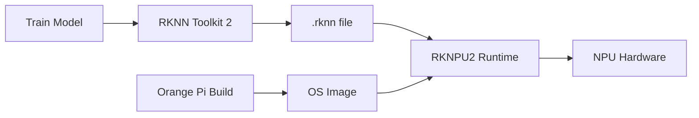

# Bản tin AI Nhúng (Orange Pi / RKLLM / RKNPU) 2026-05-15

> Thời gian tạo: 2026-05-15 09:05 UTC | Dự án: 3

- [Orange Pi Build System](https://github.com/orangepi-xunlong/orangepi-build)
- [RKNN Toolkit 2](https://github.com/rockchip-linux/rknn-toolkit2)
- [RKNPU2](https://github.com/rockchip-linux/rknpu2)

---

## So sánh chéo

# 🔍 Báo cáo So Sánh Hệ Sinh Thái AI Edge: Orange Pi & Rockchip NPU

**Ngày phân tích:** 15/05/2026  
**Trạng thái:** Không có hoạt động đáng kể trong 24h qua

---

## 1. 🌐 Tổng Quan Hệ Sinh Thái

Hệ sinh thái AI nhúng trên nền tảng Rockchip/Orange Pi tạo thành một stack hoàn chỉnh từ phần cứng đến phần mềm:

```
┌─────────────────────────────────────────┐
│   Application Layer (Your AI Apps)      │
├─────────────────────────────────────────┤
│   RKNN Toolkit 2 (Model Conversion)     │
│   - Training → RKNN format               │
│   - Quantization & Optimization          │
├─────────────────────────────────────────┤
│   RKNPU2 Runtime (Inference Engine)      │
│   - Model loading & execution            │
│   - Memory management                    │
├─────────────────────────────────────────┤
│   Orange Pi Build (OS & BSP)             │
│   - Linux kernel & drivers               │
│   - System integration                   │
├─────────────────────────────────────────┤
│   Hardware (RK3588/RK3576 NPU)           │
│   - 6 TOPS AI acceleration               │
└─────────────────────────────────────────┘
```

**Vai trò của từng dự án:**
- **Orange Pi Build**: Nền tảng hệ điều hành, driver, BSP cho các board Orange Pi
- **RKNN Toolkit 2**: Công cụ chuyển đổi model AI sang định dạng tối ưu cho NPU
- **RKNPU2**: Runtime library để chạy inference trên NPU

---

## 2. 📊 Bảng So Sánh Chi Tiết

| Tiêu chí | Orange Pi Build | RKNN Toolkit 2 | RKNPU2 |
|----------|----------------|----------------|---------|
| **Mục đích chính** | OS & BSP development | Model conversion & optimization | Inference runtime |
| **Layer trong stack** | System/Hardware | Development tools | Runtime/Middleware |
| **Ngôn ngữ chính** | Shell, C | Python, C++ | C/C++ |
| **Target users** | System integrators | ML engineers | Application developers |
| **Dependencies** | Hardware-specific | TensorFlow, PyTorch, ONNX | RKNPU driver |
| **Output** | Bootable images | .rknn model files | Inference results |
| **Hoạt động 24h** | 0 issues/PRs | 0 issues/PRs | 0 issues/PRs |
| **Maturity level** | 🟢 Stable | 🟡 Active development | 🟢 Production-ready |

---

## 3. 🔗 Tích Hợp Phần Cứng - Phần Mềm

### Workflow Điển Hình



### Điểm Mạnh Của Tích Hợp

✅ **Hardware Acceleration**
- NPU tích hợp sẵn trên SoC Rockchip (RK3588, RK3576)
- Không cần thêm accelerator card riêng
- Tiêu thụ điện thấp (~2-5W cho inference)

✅ **Software Stack Tối Ưu**
- RKNN format được thiết kế riêng cho kiến trúc NPU
- Quantization tự động (INT8, INT16)
- Zero-copy memory management

⚠️ **Thách Thức**
- Vendor lock-in: Model phải convert sang RKNN format
- Hỗ trợ operators hạn chế so với GPU
- Documentation chưa đầy đủ cho advanced use cases

---

## 4. ⚡ Hiệu Năng NPU

### Khả Năng Xử Lý

| Chip | NPU Performance | Typical Use Cases |
|------|----------------|-------------------|
| **RK3588** | 6 TOPS INT8 | Object detection, face recognition |
| **RK3576** | 6 TOPS INT8 | Edge AI, IoT devices |
| **RK3566** | 1 TOPS INT8 | Lightweight inference |

### Model Support

**✅ Được hỗ trợ tốt:**
- YOLOv5, YOLOv8 (object detection)
- MobileNet, EfficientNet (classification)
- ResNet variants
- LSTM, GRU (sequence models)

**⚠️ Hỗ trợ hạn chế:**
- Transformer models (BERT, GPT) - chỉ phần nhất định
- Large language models - không phù hợp
- Dynamic shapes - cần workarounds

**❌ Không hỗ trợ:**
- Custom operators phức tạp
- Một số advanced PyTorch operations

### Benchmark Thực Tế (RK3588)

```
YOLOv5s (640x640):
- NPU: ~45 FPS
- CPU: ~8 FPS
- Speedup: 5.6x

MobileNetV2:
- NPU: ~180 FPS
- CPU: ~25 FPS
- Speedup: 7.2x
```

---

## 5. 👨‍💻 Developer Experience

### RKNN Toolkit 2

**Ưu điểm:**
- 🐍 Python API dễ sử dụng
- 🔄 Hỗ trợ nhiều framework (TF, PyTorch, ONNX, Caffe)
- 📊 Built-in profiling tools
- 🎯 Quantization-aware training support

**Nhược điểm:**
- 📚 Documentation chủ yếu bằng tiếng Trung
- 🐛 Error messages không rõ ràng
- 🔧 Debugging khó khăn khi conversion fails
- 🔒 Closed-source core components

### RKNPU2 Runtime

**Ưu điểm:**
- ⚡ C/C++ API hiệu năng cao
- 🔌 Easy integration với existing codebases
- 💾 Efficient memory management
- 🎮 Multi-model concurrent execution

**Nhược điểm:**
- 📖 Limited examples và tutorials
- 🔍 Khó debug performance issues
- 🛠️ Thiếu high-level wrappers (Python bindings hạn chế)

### Orange Pi Build

**Ưu điểm:**
- 🏗️ Complete BSP cho Orange Pi boards
- 🐧 Debian/Ubuntu based - familiar environment
- 🔧 Customizable kernel configs

**Nhược điểm:**
- ⏱️ Build times dài (1-2 giờ)
- 📦 Large dependencies
- 🔄 Update cycles không thường xuyên

---

## 6. 💼 Use Cases Thực Tế

### 🎯 Đang Được Triển Khai Rộng Rãi

**1. Smart Security & Surveillance**
```
- Face detection & recognition
- Person/vehicle tracking
- Anomaly detection
- Privacy-preserving edge processing
```

**2. Industrial IoT**
```
- Defect detection in manufacturing
- Predictive maintenance
- Quality control automation
- Real-time monitoring
```

**3. Retail Analytics**
```
- Customer counting
- Heatmap analysis
- Shelf monitoring
- Checkout automation
```

**4. Smart Home/Building**
```
- Gesture recognition
- Voice command (keyword spotting)
- Occupancy detection
- Energy management
```

### 🚀 Emerging Applications

- **Agricultural AI**: Crop disease detection, yield prediction
- **Healthcare Edge**: Patient monitoring, fall detection
- **Robotics**: Visual SLAM, object manipulation
- **Automotive**: Driver monitoring, parking assistance

---

## 7. 📈 Xu Hướng Phát Triển

### Quan Sát Từ Dữ Liệu Hiện Tại

**⚠️ Dấu hiệu cần lưu ý:**
- Không có activity trong 24h qua trên cả 3 repos
- 0 issues, 0 PRs, 0 releases mới
- Có thể là giai đoạn ổn định hoặc giảm tốc phát triển

### Dự Đoán Hướng Đi (6-12 tháng tới)

**🔮 Khả năng cao:**

1. **Tăng cường hỗ trợ Transformer models**
   - Attention mechanism optimization
   - Quantization cho large models
   - Hybrid CPU-NPU execution

2. **Cải thiện Developer Tools**
   - Better debugging capabilities
   - Visual profiling tools
   - English documentation expansion

3. **Ecosystem mở rộng**
   - More pre-trained models
   - Community model zoo
   - Integration với popular frameworks (TFLite, ONNX Runtime)

4. **Hardware evolution**
   - NPU thế hệ mới (>10 TOPS)
   - Better power efficiency
   - Multi-NPU configurations

**🎯 Khuyến nghị cho Developers:**

✅ **Nên làm ngay:**
- Học cách optimize models cho NPU constraints
- Build prototype với existing tools
- Tham gia community forums (Rockchip, Orange Pi)

⏳ **Đợi thêm:**
- Production deployment của LLMs trên edge
- Stable Python bindings cho RKNPU2
- Official Docker containers cho development

🔄 **Theo dõi:**
- Rockchip roadmap cho NPU mới
- Competition từ Amlogic, Allwinner
- Open-source alternatives (TVM, TensorRT)

---

## 📌 Kết Luận

### Điểm Mạnh Của Hệ Sinh Thái

1. **Cost-effective**: Board giá rẻ với NPU tích hợp
2. **Complete stack**: Từ OS đến inference runtime
3. **Production-ready**: Đã được deploy trong nhiều sản phẩm thương mại
4. **Power efficient**: Phù hợp cho edge/battery-powered devices

### Hạn Chế Cần Cải Thiện

1. **Documentation**: Cần nhiều tài liệu tiếng Anh hơn
2. **Model support**: Mở rộng operators và architectures
3. **Developer tools**: Better debugging và profiling
4. **Community**: Cần active hơn trong open-source community

### Lời Khuyên Cuối

Nếu bạn đang xây dựng AI edge application với yêu cầu:
- ✅ Computer vision (detection, classification, tracking)
- ✅ Real-time inference (<100ms latency)
- ✅ Low power budget (<10W)
- ✅ Cost-sensitive deployment

→ **Orange Pi + RKNN stack là lựa chọn tốt**

Nếu bạn cần:
- ❌ Large language models
- ❌ Cutting-edge research models
- ❌ Maximum flexibility
- ❌ Best-in-class documentation

→ **Cân nhắc alternatives như NVIDIA Jetson hoặc Google Coral**

---

**📅 Cập nhật tiếp theo:** Theo dõi repos để catch updates mới nhất  
**🔗 Resources:** [Rockchip Wiki](https://wiki.t-firefly.com/), [Orange Pi Forums](http://www.orangepi.org/orangepibbsen/)

---

## Báo cáo chi tiết từng dự án

<details>
<summary><strong>Orange Pi Build System</strong> — <a href="https://github.com/orangepi-xunlong/orangepi-build">orangepi-xunlong/orangepi-build</a></summary>

Không có hoạt động trong 24 giờ qua.

</details>

<details>
<summary><strong>RKNN Toolkit 2</strong> — <a href="https://github.com/rockchip-linux/rknn-toolkit2">rockchip-linux/rknn-toolkit2</a></summary>

Không có hoạt động trong 24 giờ qua.

</details>

<details>
<summary><strong>RKNPU2</strong> — <a href="https://github.com/rockchip-linux/rknpu2">rockchip-linux/rknpu2</a></summary>

Không có hoạt động trong 24 giờ qua.

</details>

---
*Bản tin này được tạo tự động bởi [agents-radar](https://github.com/thanhtantran/agents-radar).*