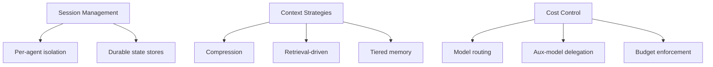

# Bản tin Hệ sinh thái OpenClaw 2026-06-20

> Issues: 59 | PRs: 500 | Dự án: 9 | Thời gian tạo: 2026-06-20 02:00 UTC

- [OpenClaw](https://github.com/openclaw/openclaw)
- [NanoBot](https://github.com/HKUDS/nanobot)
- [Zeroclaw](https://github.com/zeroclaw-labs/zeroclaw)
- [PicoClaw](https://github.com/sipeed/picoclaw)
- [NanoClaw](https://github.com/nanocoai/nanoclaw)
- [IronClaw](https://github.com/nearai/ironclaw)
- [LobsterAI](https://github.com/netease-youdao/LobsterAI)
- [CoPaw](https://github.com/agentscope-ai/CoPaw)
- [Hermes-Agent](https://github.com/nousresearch/hermes-agent)

---

## Phân tích sâu OpenClaw

# Báo cáo phân tích OpenClaw - 2026-06-20

## 1. 🎯 Tóm tắt hôm nay

Hôm nay OpenClaw tập trung xử lý các lỗi nghiêm trọng về tính tương thích và độ ổn định. Điểm nổi bật là việc phát hiện lỗi nghiêm trọng với Claude Code 2.1.x (#95171) khiến mọi tool call thất bại do thay đổi schema. Dự án đang trong giai đoạn beta 2026.6.9 với nhiều cải tiến về Telegram và session management, nhưng vẫn còn nhiều vấn đề về memory leak, event loop saturation và session isolation cần giải quyết.

## 2. 🚀 Releases

### **v2026.6.9-beta.1** (2026-06-19)

**Tính năng chính:**
- **📱 Telegram nâng cao**: Hỗ trợ rich HTML, markdown formatting, sticker preservation, progress drafts và command output rendering tốt hơn
- **🔄 Agent recovery cải thiện**: Retry logic và terminal outcomes được tăng cường
- **Liên quan đến nhiều PR**: #93286, #93164, #93124, #93364, #93130, #93088, #93281

**Ý nghĩa**: Release này tập trung cải thiện trải nghiệm người dùng trên Telegram và tăng độ tin cậy của agent recovery - hai điểm đau quan trọng từ phản hồi cộng đồng.

## 3. 📊 Tiến độ dự án

### **PRs quan trọng đang xử lý**

**🔴 Critical - Tương thích:**
- **#95174, #95173, #95172**: Fix lỗi schema với Claude Code 2.1.x - cần merge gấp vì blocking mọi tool calls
- **#95153**: Sửa dashboard session orphaning khi reconnect

**🟡 High Priority - Stability:**
- **#84792**: Memory flush trước compaction (rating: 🐚 platinum hermit) - ready for review
- **#87681**: Surface OOM score adjustment cho Linux exec commands
- **#85241**: Fix MCP loopback server teardown khi reused

**🟢 Feature Enhancement:**
- **#93187**: Exclude archive transcripts khỏi dreaming corpus - cải thiện chất lượng memory
- **#85055**: Memory wiki cache manifest với claim supersession
- **#95132**: Trim bundled skill set từ 57 xuống 14 skills

### **Xu hướng phát triển:**

1. **Session & Memory Management** (15+ issues/PRs): Chiếm tỷ trọng lớn nhất, xử lý các vấn đề về session isolation, memory leak, và compaction deadlock
2. **Channel Adapters** (10+ issues/PRs): Cải thiện Telegram, WhatsApp, Discord adapters với better message rendering
3. **Security Hardening** (5+ issues): Auth profile security, sandbox policy, credential scrubbing

## 4. 💬 Điểm nổi bật cộng đồng

### **Issues có nhiều tương tác nhất:**

**🦞 #91588 - Gateway Memory Leak (13 comments, P0)**
- RSS tăng từ 350MB → 15.5GB trong 2-3 ngày → OOM crash
- Ảnh hưởng nghiêm trọng đến production deployments
- Nhiều người dùng báo cáo vấn đề tương tự

**🦞 #63829 - Per-agent memory-wiki vault (10 comments, 👍9)**
- Feature request được cộng đồng ủng hộ mạnh
- Cần thiết cho multi-agent setups để tránh knowledge pollution
- Đang chờ maintainer review và product decision

**🐚 #84903 - Event loop blocking (8 comments)**
- Một agent stall block toàn bộ Gateway event loop
- Session isolation failure ảnh hưởng availability
- Critical cho production reliability

### **Vấn đề người dùng quan tâm:**

1. **Production Stability**: Memory leaks, event loop saturation, OOM crashes
2. **Multi-agent Support**: Session isolation, per-agent configuration
3. **Channel Experience**: Rich message rendering, progress indicators

## 5. 🐛 Ổn định & Bugs

### **Critical Issues (P0-P1):**

**Memory & Resource Management:**
- **#91588**: Gateway memory leak 350MB→15.5GB (P0, 🦞 diamond lobster)
- **#84771**: Event loop saturation 28-64s delay during startup (P1, 🐚 platinum hermit)
- **#84983**: Native cron saturates event loop (P1, 🐚 platinum hermit)
- **#84843**: Feishu plugin memory leak - OOM sau 6-16 phút (P1)

**Session Isolation:**
- **#84903**: Single stalled agent blocks entire Gateway (P1, 🐚 platinum hermit)
- **#84777**: Compaction causes Pi runtime deadlock (P1, 🦐 gold shrimp)
- **#95165**: Watchdog kills sessions during slow Anthropic responses (P1, 🐚 platinum hermit)

**Auth & Security:**
- **#84942**: Sandbox policy reports "sandboxed" but Claude CLI disables sandbox (P1, 🦞)
- **#84865**: User-switched model has no fallback chain → session deadlock (P1, 🦞)

**Regression:**
- **#95171**: Claude Code 2.1.156 rejects deprecated permission schema (P1, 🦞) - **có 3 PRs đang fix**
- **#95121**: Codex OAuth turns spend ~28s after upgrade to 2026.6.8 (P2, 🐚)

### **Patterns phổ biến:**

1. **Event loop bottlenecks**: Synchronous operations block Node.js event loop
2. **Memory management**: Leaks trong gateway, plugins, và session state
3. **Session lifecycle**: Recovery, compaction, và isolation failures
4. **Provider compatibility**: Breaking changes trong external APIs

## 6. 🎁 Yêu cầu tính năng

### **Được cộng đồng ủng hộ:**

**🌟 #63829 - Per-agent memory-wiki vault (👍9, P1)**
- Cho phép mỗi agent có knowledge base riêng
- Tránh knowledge pollution trong multi-agent setups
- Đã có security review requirement

**#53638 - Per-channel/group model override (👍2, P2)**
- Config model khác nhau cho từng channel/group/DM
- Hiện chỉ có global default hoặc runtime override
- 6 comments cho thấy nhu cầu thực tế

**#90370 - PostgreSQL thay SQLite (👍2, P3)**
- User muốn dùng PostgreSQL thống nhất thay vì SQLite bắt buộc
- Đặc biệt cho high-concurrency scenarios
- Yêu cầu từ teams đã có PostgreSQL infrastructure

### **Infrastructure & DevEx:**

**#94279 - Detect containerized environments (P3)**
- Disable update suggestions khi chạy trong container
- Cải thiện container/K8s deployment experience

**#93884 - Document gateway-host agent boundary (P3)**
- Clarify security boundary giữa host và managed runtime
- Important cho production security posture

## 7. 👥 Phản hồi người dùng

### **Pain Points chính:**

1. **Production Reliability** 😰
   - Memory leaks khiến gateway crash sau vài ngày
   - Event loop blocking làm hệ thống unresponsive
   - Nhiều users báo cáo fleet instability (#94686)

2. **Multi-agent Management** 🤔
   - Session isolation failures ảnh hưởng cross-agent
   - Thiếu per-agent configuration granularity
   - Memory/wiki sharing gây knowledge pollution

3. **Channel Experience** 📱
   - Telegram rich message regression (#94885)
   - WhatsApp group history drops media (#84803)
   - Discord /usage command không hoạt động (#93905)

4. **Developer Experience** 🔧
   - Breaking changes không được document rõ (#95171)
   - Config commands cause gateway hang (#85002)
   - Update process downgrade dependencies (#85184)

### **Positive Feedback:**

- Beta 2026.6.9 cải thiện đáng kể Telegram experience
- Memory-wiki plugin được đánh giá cao
- Cộng đồng active trong bug reporting và testing

## 8. 📋 Backlog & Roadmap

### **Immediate Focus (dựa trên PR activity):**

**Phase 1 - Critical Fixes (tuần này):**
- ✅ Fix Claude Code 2.1.x compatibility (#95174, #95173, #95172)
- 🔄 Address gateway memory leak (#91588) - still investigating
- 🔄 Fix event loop saturation issues (#84771, #84983, #84903)

**Phase 2 - Stability Hardening (2-4 tuần):**
- Session isolation improvements
- Memory management refactoring
- Watchdog timeout tuning
- Auth & security hardening

**Phase 3 - Feature Enhancement:**
- Per-agent memory-wiki vaults (#63829)
- Channel-specific model overrides (#53638)
- Trim bundled skills (#95132)
- PostgreSQL support exploration (#90370)

### **Long-term Initiatives:**

1. **Architecture Evolution**:
   - Session isolation refactor để tránh blocking
   - Memory management overhaul
   - Plugin lifecycle improvements

2. **Developer Experience**:
   - Better update mechanism without downgrades
   - Container-aware behaviors
   - Improved error messages & diagnostics

3. **Enterprise Features**:
   - Multi-agent coordination
   - Advanced auth & security
   - Production monitoring & observability

---

## 🎬 Kết luận

OpenClaw đang ở giai đoạn critical stability improvements sau beta 2026.6.9. Dự án có active community với feedback chất lượng, nhưng đang đối mặt với các vấn đề quan trọng về memory management, event loop blocking và session isolation. 

**Điểm mạnh**: Active development, responsive maintainers, good beta release cadence

**Cần cải thiện**: Production stability, breaking change management, documentation clarity

**Khuyến nghị**: Không nên deploy production cho đến khi các P0/P1 memory & stability issues được resolve (theo dõi #91588, #84771, #95171).

---

## So sánh hệ sinh thái chéo

# 📊 Báo cáo So sánh Hệ sinh thái AI Agent - 2026-06-20

---

## 1. 🌐 Tổng quan Hệ sinh thái

Hệ sinh thái AI agent đang trong giai đoạn **maturation với sự phân hóa rõ nét**. Sau làn sóng innovation đầu tiên, các dự án đang tìm kiếm định vị riêng: từ enterprise-ready platforms (OpenClaw, Hermes-Agent) đến focused solutions (NanoBot cho developers, PicoClaw cho embedded systems). 

**Điểm chung đáng chú ý:** Tất cả dự án đều đối mặt với **production stability challenges** - memory leaks, event loop saturation, session management. Điều này phản ánh việc AI agents chuyển từ demos sang real-world deployments.

---

## 2. 📈 Bảng So sánh Hoạt động

| Dự án | Issues | PRs | Releases | Community | Maturity | Focus Area |
|-------|--------|-----|----------|-----------|----------|------------|
| **OpenClaw** | 59 | 500 | 1 (beta) | 🔴 High stress | 🟡 Beta | Production stability |
| **Hermes-Agent** | 9 | 50 | 1 (v0.17.0) | 🟢 Active | 🟢 Mature | Enterprise features |
| **ZeroClaw** | 7 | 50 | 1 (v0.8.1) | 🟢 Healthy | 🟢 Stable | Platform evolution |
| **NanoBot** | 10 | 33 | 0 | 🟡 Growing | 🟡 Maturing | Developer experience |
| **PicoClaw** | 4 | 7 | 1 (nightly) | 🟡 Modest | 🟡 Beta | Security hardening |
| **NanoClaw** | 0 | 5 | 0 | 🔵 Quiet | 🔵 Early | Multi-platform |
| **IronClaw** | 4 | 30 | 0 | 🟢 Active | 🟢 Evolving | Infrastructure |
| **LobsterAI** | 4 | 0 | 1 (2026.6.18) | 🔵 Low | 🟡 Transitioning | Strategic pivot |
| **CoPaw** | 11 | 17 | 0 | 🟢 Responsive | 🟡 Stabilizing | Model compatibility |

### Chú thích màu sắc:
- 🔴 Critical issues/high pressure
- 🟢 Healthy development
- 🟡 Moderate activity
- 🔵 Low activity/early stage

---

## 3. 🎯 Vị thế của OpenClaw

### **Positioning: "The Workhorse Under Pressure"**

OpenClaw đang ở vị trí **market leader với technical debt cao nhất**. Với 59 issues và 500 PRs, dự án thể hiện:

**Điểm mạnh:**
- ✅ **Scale**: Community lớn nhất, adoption rộng nhất
- ✅ **Feature richness**: Đa dạng nhất về channels, providers, integrations
- ✅ **Active development**: Beta cadence nhanh (2026.6.9)

**Điểm yếu nghiêm trọng:**
- ❌ **Production instability**: Memory leaks (#91588 - RSS 350MB→15.5GB)
- ❌ **Event loop saturation**: Single stalled agent blocks entire Gateway (#84903)
- ❌ **Breaking changes**: Claude Code 2.1.x compatibility issue (#95171)

### **So với đối thủ:**

| Tiêu chí | OpenClaw | Hermes-Agent | ZeroClaw |
|----------|----------|--------------|----------|
| Community size | 🥇 Largest | 🥈 Large | 🥉 Growing |
| Stability | 🔴 Critical issues | 🟢 Stable | 🟢 Stable |
| Enterprise readiness | 🟡 Promising | 🟢 Ready | 🟢 Ready |
| Innovation velocity | 🟢 Fast | 🟢 Fast | 🟢 Steady |

**Insight:** OpenClaw có **widest moat** nhưng đang facing **technical debt crisis**. Nếu không giải quyết P0 issues (#91588, #84771) trong 2-4 tuần, có thể mất user trust cho competitors.

---

## 4. 🔧 Hướng Kỹ thuật Chung

### **Convergent Patterns:**

#### A. **Session & Context Management** (8/9 dự án)
```
OpenClaw:  Session isolation, memory compaction deadlock
NanoBot:   SuspendTurn (async/human-in-loop), per-agent memory vaults
ZeroClaw:  Context window awareness, Dream Mode memory
Hermes:    Scroll context manager, recency-aware ranking
CoPaw:     ChromaDB maintenance, context compaction timeout
```
**Insight:** Context management là **#1 pain point** ngành. Không ai giải quyết được hoàn hảo.

#### B. **Multi-channel Architecture**
- **OpenClaw**: Telegram, Discord, WhatsApp, Matrix
- **Hermes**: iMessage, Email, Lark/Feishu mới
- **ZeroClaw**: Discord interactions hoàn thiện
- **NanoBot**: CLI, Telegram, Discord, Matrix, Feishu

**Trend:** Chuyển từ **single-channel** sang **omnichannel orchestration**.

#### C. **Cost Optimization**
- **Hermes**: Background review với aux-model routing (#49252)
- **ZeroClaw**: Agent cost tracking reloadable (#8004)
- **NanoBot**: Model presets cho cron jobs (#4416)

**Insight:** Production users quan tâm **cost** ngang ngửa **capability**.

#### D. **Security Hardening**
```
PicoClaw:   SSRF bypass fixes (#3143)
NanoClaw:   Permission inheritance via OneCLI (#2605)
Hermes:     Anthropic OAuth, Matrix E2EE, email DMARC
IronClaw:   Tool permissions UI, HMAC receipts
```

**Pattern:** Security chuyển từ afterthought sang **first-class concern**.

---

## 5. ⚔️ Điểm Khác biệt

### **Chiến lược Phân hóa:**

#### **OpenClaw: Breadth-first**
- Max channels, max providers, max integrations
- Chiến lược: "One agent for all workflows"
- Trade-off: Complexity cao, stability challenges

#### **Hermes-Agent: Enterprise polish**
- Focus vào desktop experience, i18n (15 languages)
- Operational skills, observability metadata
- Trade-off: Slower to add new channels, more deliberate

#### **ZeroClaw: Platform play**
- Architecture-first: clean abstractions, feature gates
- Hosted deployment prep, automation infrastructure
- Trade-off: Higher entry barrier, requires more setup

#### **NanoBot: Developer-centric**
- Inline TUI, model presets, async frameworks
- "For programmers who want AI help, not replacement"
- Trade-off: Narrower target audience

#### **PicoClaw: Embedded/edge focus**
- Lightweight, security-hardened
- IoT/embedded use cases
- Trade-off: Feature set giới hạn

### **Bảng So sánh Feature Matrix:**

| Feature | OpenClaw | Hermes | ZeroClaw | NanoBot | PicoClaw |
|---------|----------|--------|----------|---------|----------|
| **Multi-channel** | ⭐⭐⭐⭐⭐ | ⭐⭐⭐⭐ | ⭐⭐⭐⭐ | ⭐⭐⭐⭐ | ⭐⭐ |
| **Desktop native** | ⭐⭐⭐ | ⭐⭐⭐⭐⭐ | ⭐⭐⭐ | ⭐⭐⭐ | ⭐⭐ |
| **Enterprise auth** | ⭐⭐⭐ | ⭐⭐⭐⭐⭐ | ⭐⭐⭐⭐ | ⭐⭐ | ⭐⭐⭐ |
| **Local models** | ⭐⭐⭐⭐ | ⭐⭐⭐ | ⭐⭐⭐ | ⭐⭐⭐⭐ | ⭐⭐⭐⭐ |
| **Memory systems** | ⭐⭐⭐⭐ | ⭐⭐⭐⭐ | ⭐⭐⭐⭐⭐ | ⭐⭐⭐ | ⭐⭐ |
| **Developer tools** | ⭐⭐⭐ | ⭐⭐⭐ | ⭐⭐⭐⭐ | ⭐⭐⭐⭐⭐ | ⭐⭐⭐ |
| **Production ready** | ⭐⭐ | ⭐⭐⭐⭐⭐ | ⭐⭐⭐⭐ | ⭐⭐⭐ | ⭐⭐⭐ |

---

## 6. 👥 Mức độ Trưởng thành Cộng đồng

### **Tier 1: Mature Communities**

**🥇 Hermes-Agent**
- 245 contributors trong v0.17.0
- Community-driven i18n (15 languages)
- High-quality bug reports với repro steps
- **Đặc điểm:** Professional users, enterprise deployments

**🥈 ZeroClaw**
- 45 contributors trong release cycle
- Active Discord (inferred từ issue references)
- Automation-first culture (bot-generated PRs)
- **Đặc điểm:** Technical early adopters, infrastructure focus

### **Tier 2: Growing Communities**

**OpenClaw**
- Large user base nhưng **high churn risk**
- Issues quality cao (#91588 có 13 comments detailed)
- **Vấn đề:** Nhiều production pain → frustrated users
- **Đặc điểm:** Early majority users hitting scalability walls

**NanoBot**
- Active Chinese community (Feishu plugin usage)
- Good feedback loop (issues → PRs < 4 days)
- **Đặc điểm:** Developer users, self-serve mindset

**CoPaw (QwenPaw)**
- Mix English/Chinese users
- Fast iteration (9 PRs từ 2 contributors trong 24h)
- **Đặc điểm:** Chinese market focus, responsive maintainers

### **Tier 3: Early Stage**

**PicoClaw, NanoClaw, IronClaw**
- Smaller, focused communities
- Low GitHub engagement nhưng quality contributions
- **Đặc điểm:** Niche use cases, technical depth

**LobsterAI**
- Community quiet trên GitHub
- **Potential pivot point:** Issue #2180 đề xuất strategic shift
- **Đặc điểm:** Uncertain direction, awaiting clarity

---

## 7. 🔮 Tín hiệu Xu hướng

### **A. Consolidation vs. Specialization**

**Consolidation signals:**
- OpenClaw + Hermes đang chiếm phần lớn mindshare
- Smaller projects tìm niches (PicoClaw - embedded, NanoBot - developers)

**Prediction:** Trong 6-12 tháng:
- 2-3 projects sẽ emerge as "category winners"
- 3-4 projects sẽ pivot hoặc merge
- 2-3 projects sẽ find sustainable niches

### **B. Enterprise Readiness Race**

**Current leaders:**
1. **Hermes-Agent**: Auth, observability, i18n complete
2. **ZeroClaw**: Hosted deployment prep, security hardening
3. **IronClaw**: Feature flags, multi-DB backends

**OpenClaw risk:** Stability issues có thể disqualify khỏi enterprise race despite feature richness.

### **C. Technical Convergence**

**Patterns emerging:**



**Insight:** Industry đang converge trên một số **design patterns chung**, nhưng implementation quality varies wildly.

### **D. Developer Experience Wars**

**Battleground:**
- **CLI/TUI quality** (NanoBot leading)
- **Local development setup** (one-command start)
- **Debugging tools** (IronClaw QA fixtures, Hermes observability)

**Winner characteristics:**
- Fast iteration cycles
- Clear error messages
- Good defaults, flexible overrides

### **E. Multi-modal & Agentic Workflows**

**Signals:**
- Hermes: Image edit (#41356), reasoning effort configs (#49355)
- ZeroClaw: Subagent model overrides (#4415), result aggregation (#4414)
- NanoBot: SuspendTurn for human-in-loop (#4411)

**Trend:** Chuyển từ **single-shot Q&A** sang **complex multi-step workflows** với:
- Human checkpoints
- Multi-agent coordination
- Tool chaining
- Approval gates

---

## 8. 💡 Strategic Insights

### **Cho OpenClaw:**

**🚨 Urgent (2-4 tuần):**
1. **Fix P0 stability issues** - Đây là existential threat
2. **Communication strategy** - Transparently update community về production readiness
3. **Regression prevention** - Breaking changes (#95171) không thể lặp lại

**📈 Medium-term (2-3 tháng):**
1. **Session isolation refactor** - Technical debt payment
2. **Enterprise features** - Match Hermes/ZeroClaw trên auth, observability
3. **Performance benchmarks** - Prove stability improvements với numbers

**🎯 Long-term:**
1. **Platform positioning** - Clarify: "Swiss Army knife" hay "enterprise backbone"?
2. **Governance model** - Community scale yêu cầu clear decision-making
3. **Monetization path** - Hosted offering để fund stability work?

### **Cho Ecosystem:**

**Collaboration opportunities:**
- **Standardization:** Context management patterns, MCP protocol extensions
- **Shared infrastructure:** Testing frameworks, security scanners
- **Interoperability:** Agent-to-agent communication standards

**Competitive dynamics:**
- **OpenClaw vs. Hermes:** Breadth vs. depth battle
- **ZeroClaw positioning:** Platform play requires ecosystem building
- **Niche players:** Success = find defendable specialization

---

## 9. 🎬 Kết luận

Hệ sinh thái AI agent năm 2026 đang ở **inflection point**. Sau giai đoạn "build everything fast", thị trường đang demand **production-grade reliability**. 

**Winners sẽ là những dự án:**
1. ✅ Solve stability challenges (memory, concurrency, error handling)
2. ✅ Deliver enterprise features (auth, audit, cost control)
3. ✅ Maintain velocity (innovation không chậm lại dù focus stability)

**OpenClaw có advantages lớn** (community, features) nhưng đang ở **critical juncture**. 2-4 tuần tới sẽ định hình competitive position trong 6-12 tháng.

**For watchers:** Theo dõi:
- OpenClaw #91588, #84771 resolution
- Hermes v0.18.0 features
- ZeroClaw hosted offering launch
- LobsterAI strategic direction (#2180 outcome)

---

*Báo cáo này dựa trên public data từ GitHub repositories tính đến 2026-06-20 02:02 UTC.*

---

## Báo cáo các dự án cùng nhóm

<details>
<summary><strong>NanoBot</strong> — <a href="https://github.com/HKUDS/nanobot">HKUDS/nanobot</a></summary>

# 📊 Báo cáo phân tích NanoBot - 20/06/2026

## 1. 🎯 Tóm tắt hôm nay

Ngày 20/06 chứng kiến hoạt động đóng vòng phát triển mạnh mẽ với 9 issues được đóng và nhiều PR quan trọng được merge. Dự án đang tập trung vào hoàn thiện các tính năng async/human-in-the-loop, cải thiện trải nghiệm cron job, và củng cố tính ổn định của các channel như Feishu, Telegram. Một làn sóng dọn dẹp backlog với 10 PR invalid được đóng, cho thấy đội ngũ đang tái tổ chức roadmap.

## 2. 🚀 Releases

**Không có release chính thức** trong ngày hôm nay, nhưng có dấu hiệu chuẩn bị cho một phiên bản mới với nhiều tính năng chờ merge.

## 3. 📈 Tiến độ dự án

### 🔥 PR nổi bật đang mở

**#4411 - SuspendTurn: Async & Human-in-the-Loop** 
- Cho phép tool tạm dừng turn hiện tại, chờ tương tác người dùng hoặc sự kiện async
- Quan trọng cho workflow phê duyệt, webhook callbacks
- Thiết kế sạch: không cần thêm state manager, tận dụng luồng message thường

**#4329 - Inline TUI cho CLI**
- Giao diện terminal tương tác cho `nanobot agent`
- Thay thế Rich-LiveLog bằng TUI đầy đủ khi chạy trong TTY
- Tương thích ngược với `--classic` flag

**#4415 - Spawn với model override**
- Cho phép subagent dùng model khác với parent
- Hữu ích cho phân tầng task: model nhỏ cho task đơn giản, lớn cho task phức tạp

**#4414 - Aggregated subagent results**
- Mode mới: buffer kết quả subagent, gửi một lần khi hoàn thành
- Giảm noise trong UI/channel khi spawn nhiều subagent song song

### ✅ PR đã merge gần đây

- **#4138** - Toggle built-in filesystem tools via config
- **#4230** - Timeout cho streamableHttp transport (fix hang vô hạn)
- **#4246** - Fix delete_session: xóa cả legacy files để tránh "zombie session"
- **#4342** - Fix Feishu WebSocket card parsing (cấu trúc khác HTTP)
- **#4394** - Hỗ trợ OpenAI image edits với reference images

### 🧹 Dọn dẹp backlog

10 PR invalid được đóng (#2655, #2692, #2725, #2732, #2843, #2867, #2872, #3015, #3467, #3497, #3636) - cho thấy đội ngũ đang tái định hướng roadmap, loại bỏ các nhánh cũ hoặc không còn phù hợp.

## 4. 💬 Điểm nổi bật cộng đồng

### Issues có tương tác cao

**#4013 - Stream stalled timeout (5 bình luận)**
- Lỗi hardcoded timeout 90s khi gọi LLM
- Làm gián đoạn công việc thực tế của user
- **Đã đóng** - có thể đã được fix trong các commit gần đây

**#4374 - Read/write asymmetry cho SOUL.md/USER.md (3 bình luận)**
- Bootstrap files được đọc từ project workspace nhưng ghi vào default workspace
- Gây confusion về vị trí file thực tế
- **Đã đóng** - fix trong các update gần đây

**#4389 - Per-model contextWindowTokens cho fallback (2 bình luận)**
- Fallback model có context window nhỏ hơn primary → prompt không fit
- Request: config contextWindowTokens riêng per model
- **Đã đóng** - khả năng đã được implement

## 5. 🐛 Ổn định & Bugs

### Bugs đã được fix

✅ **#4287 - Empty model responses không trigger fallback**
- DeepSeek v4-pro trả empty response trong peak hours
- Bị classify nhầm là non-fallbackable error
- **Đã fix và đóng**

✅ **#4345 - Image-strip fallback leak file path**
- Khi model không hỗ trợ image, fallback text vẫn nói "đã xem ảnh" và leak đường dẫn
- Vấn đề bảo mật và UX
- **Đã đóng**

✅ **#4052 - MCP notifications/progress bị reject**
- Pydantic validator không chấp nhận `notifications/progress`
- Gây crash khi MCP server gửi progress updates
- **Đã đóng**

### Bugs đang mở

🔴 **#4410 - Heartbeat vẫn gửi message dù được yêu cầu không gửi**
- Sau upgrade từ v0.15, cron job luôn gửi message
- User muốn silent execution cho routine checks
- **PR #4412 đang xử lý** - Suppress routine cron job notifications

## 6. 💡 Yêu cầu tính năng

### Đang mở - có khả năng implement

**#4419 - Automatic reasoning effort escalation** 
- Config default reasoning effort + escalated level
- Tự động tăng effort khi retry do quality issues
- Phù hợp với reasoning models (o1, DeepSeek R1, Gemini 2.0 Flash Thinking)

**#4418 - Heartbeat tasks deliver results to original channel**
- Hiện tại: heartbeat gửi kết quả đến channel active gần nhất
- Yêu cầu: gửi về channel nơi task được tạo
- Quan trọng cho multi-channel deployments

**#4413 - Telegram Bot API 10.1 rich messages**
- Hỗ trợ format mới của Telegram: blockquote, expand, spoiler
- Cải thiện trải nghiệm chat

### Đã đóng gần đây

- Per-model context window config (#4389)
- Cron job model presets (#4378 → PR #4416)

## 7. 🗣️ Phản hồi người dùng

### Positive signals

- User @mxnbf khen v0.1.5post2 "very good" trước khi gặp bug trong v0.2.0
- Nhiều user tích cực report bugs với repro steps chi tiết
- Cộng đồng tham gia test và feedback các tính năng mới

### Pain points

- **Stability regressions** khi upgrade version (v0.15 → v0.2.x)
- **Empty/timed-out responses** từ các provider trong peak hours
- **Multi-channel complexity**: routing, session management, delivery context
- **Config discoverability**: nhiều feature có config nhưng user không biết

### Engagement patterns

- Issues thường được response và đóng trong 1-4 ngày
- PR có review process kỹ lưỡng với test coverage requirements
- Active maintainer @yu-xin-c (nhiều PR trong ngày)

## 8. 🗺️ Backlog & Roadmap

### Đang triển khai (có PR)

- 🔄 Async/Human-in-the-Loop framework (SuspendTurn)
- 🔄 Model preset system cho cron jobs và subagents
- 🔄 Inline TUI cho better CLI experience
- 🔄 Subagent result aggregation

### Likely next priorities (based on open issues)

- ⏱️ Reasoning effort auto-escalation
- 📱 Channel improvements (Telegram rich messages, XMPP stability)
- 🎛️ Dream system controls (update scope, manual triggers)
- 🧪 Test coverage expansion (git workflows, edge cases)

### Architectural themes

- **Modularity**: từng component có enable flag riêng
- **Multi-model orchestration**: primary/fallback, subagent override, cron presets
- **Channel-agnostic**: cùng core logic cho CLI, Telegram, Discord, Matrix, Feishu
- **Progressive disclosure**: advanced features không ảnh hưởng simple use cases

---

## 📌 Kết luận

NanoBot đang trong giai đoạn **maturation với focus cao vào reliability và UX**. Việc đóng 9 issues và dọn 10 PR invalid cho thấy đội ngũ đang kiểm soát tốt backlog. Các tính năng mới (SuspendTurn, model presets, TUI) đều hướng đến developer experience tốt hơn. Cộng đồng active với feedback chất lượng, maintainer responsive. Dự án đang trên quỹ đạo tốt cho một release ổn định sắp tới.

</details>

<details>
<summary><strong>Zeroclaw</strong> — <a href="https://github.com/zeroclaw-labs/zeroclaw">zeroclaw-labs/zeroclaw</a></summary>

# Báo cáo phân tích ZeroClaw - Ngày 2026-06-20

## 📊 Tóm tắt hôm nay

ZeroClaw tiếp tục đà phát triển mạnh mẽ sau bản v0.8.1 với 50 pull requests và 7 issues hoạt động. Hôm nay đánh dấu sự xuất hiện của tính năng onboarding đàm thoại mới (#8034), cùng nhiều cải tiến về Discord interactions, agent cost tracking, và TUI. Đội ngũ tập trung mạnh vào việc ổn định core runtime và xử lý các edge cases từ phản hồi người dùng.

---

## 🚀 Releases

### v0.8.1 (Phát hành: 2026-06-19)

**Đặc điểm nổi bật:**
- **Quy mô**: 207 commits từ 45 contributors
- **Phân bố**: 123 bug fixes + 46 tính năng mới
- **Trọng tâm**: Ổn định runtime đa agent, channels và provider stack

**Tính năng chính:**
- ✅ Delete/rename configuration với cascade logic
- ✅ Discord slash commands tự động sinh từ skills đã cài
- ✅ OpenAI cached-input pricing path
- ✅ Phase 0 agent evaluation harness

**Ý nghĩa**: Đây là bản patch đầu tiên tập trung vào stabilization sau major release v0.8.0, cho thấy chiến lược "ship fast, stabilize faster" của team.

---

## 🏗️ Tiến độ dự án

### **Epic-level Features đang triển khai**

#### 🎮 Discord Interactions (EPIC B - #7965)
- **Trạng thái**: CLOSED (đã merge)
- **Quy mô**: XL, risk: high
- **Thành tựu**: 
  - Hoàn thiện interaction surface: buttons, selects, modals
  - Buttoned tool-approval flow
  - Slash command autocomplete
- **Tác động**: Discord channel giờ đạt feature parity với các channel khác

#### 🧠 Dream Mode Memory (#6693, #7797)
- **Trạng thái**: Stacked PRs đang review
- **Đặc điểm**:
  - PR #6693: Base Dream Mode với 5 phases (gather → reflect → consolidate → prune → report)
  - PR #7797: Per-agent opt-in configuration
  - Local-only by default, opt-in LLM reflection
- **Ý nghĩa**: Đây là bước tiến lớn về autonomous memory management cho long-running agents

#### 🗄️ Multi-Database Session Backends (#6893)
- **Scope**: PostgreSQL, Oracle 23ai, MySQL 9.0+, IBM Db2 12.1.5
- **Kiến trúc**: Feature-gated, optional backends
- **Use case**: Multi-agent fleets với shared session state
- **Tình trạng**: Đang review, cần validation trên các databases

---

### **Runtime Infrastructure**

#### 📊 Context Window Awareness (#7946)
- Model context usage bar xuất hiện trên:
  - Zerocode TUI
  - Gateway agent chat
  - CLI interactive mode
- Single source of truth: `config.toml`
- **Impact**: Tăng visibility cho token budget management

#### 💰 Cost Tracking Fixes (#8004)
- **Bug**: Budget config bị frozen at boot
- **Fix**: Làm reloadable, không cần restart daemon
- **Tác động**: Operators có thể điều chỉnh budget on-the-fly

#### 🔐 Security - HMAC Tool Receipts (#8009)
- **Vấn đề**: Receipts chỉ hoạt động trong channel orchestrator
- **Fix**: Wire through tất cả agent turn paths (ACP, gateway WS, CLI)
- **Severity**: High risk fix cho tool execution verification

---

### **Developer Experience**

#### 🎯 Conversational Onboarding (#8034, #8033)
- **Concept**: Port từ OpenClaw's "Crestodian" 
- **Approach**: Chat-based setup thay vì wizard steps
- **Mục tiêu**: Plain-language path cho new users
- **Status**: Issue mới tạo + PR implementation đang active

#### 🖥️ Zerocode TUI Enhancements (#8006)
- Thêm Aliases/Costs tabs vào provider view
- Feature parity với web gateway
- Focus on power-user workflows

---

## ⭐ Điểm nổi bật cộng đồng

### Issue được quan tâm nhất

**#7950: Docker images include ZeroClaw docs**
- 👤 Tác giả: @pauldoo
- 🔥 Vấn đề: Agents không thể trả lời questions về ZeroClaw features/config
- 💡 Đề xuất: Bundle documentation vào Docker images
- 📊 Labels: `enhancement`, `docs`, `dependencies`, `priority:p3`
- **Insight**: Community muốn agents có self-awareness về capabilities của chính nó

---

## 🐛 Ổn định & Bugs

### **Critical Fixes đã merge/đang xử lý**

#### 🔴 High Priority

1. **Stream Duplication (#8014)** - OPEN
   - Native tool-call providers duplicate narration
   - Anthropic shape providers affected
   - Risk: high, user-facing bug

2. **File Descriptor Exhaustion (#7983)** - OPEN
   - EMFILE in IPC accept loop
   - Daemon stability issue under load
   - Auto-generated fix từ automation

3. **Provider Dispatch Gate (#8019)** - OPEN
   - CI failing on master branch
   - `fetch_provider_catalog` violating SSOT pattern
   - Blocking CI green status

#### 🟡 Medium Priority

4. **Config Cache Invalidation (#7982)**
   - `static_voice_peers` cached on channel handle
   - Config reload không áp dụng
   - Impact: Telegram voice channels

5. **Vision Provider Honor (#7972)**
   - Inbound images không respect `vision_provider` setting
   - Multimodal workflow affected

6. **Groq Reasoning Strip (#7616)**
   - Groq rejects `reasoning_content` on replay
   - OpenAI-compatible endpoint quirk
   - Impact: Reasoning model routing

---

### **Test Infrastructure**

**Date Flake Fix (#8036)**
- Test `turn_cache_hit_emits_agent_end_with_none_tokens` flaky
- Root cause: System prompt có `Local::now()`
- Fix: Pin timestamp trong test
- **Pattern**: Team proactive về test determinism

---

## 💡 Yêu cầu tính năng

### **Đã được implement (đang review)**

1. **Session ID for Shell Tools (#8035)**
   - Expose `ZEROCLAW_SESSION_ID` to skill CLI wrappers
   - Enable async result delivery
   - Author: @RyanHoldren

2. **Slash Command Localizations (#7922)**
   - Per-locale Discord command descriptions
   - Guild-scoped registration
   - Hoàn thiện Discord feature surface

3. **SOP Run Store (#8001)**
   - Durable run-state abstraction
   - CAS-claim admission logic
   - Foundation cho SOP durability/observability

---

### **Đang trong discussion**

**#6826: Zerocode (TUI Tracker)**
- Standalone terminal UI
- Parity với web dashboard
- Target: Power users, headless servers, enclave deployments
- Rename: `zeroclaw-tui` → `zerocode`

**#6825: Zerocode UX Tracker**
- Theming, keybindings, navigation
- Accessibility concerns
- Polish layer cho TUI experience

---

## 👥 Phản hồi người dùng

### **Pain Points được raise**

1. **Documentation Access (#7950)**
   - Agents không self-aware về features
   - Cần docs baked vào container images
   - Community solution-oriented

2. **Cost Visibility (#7946)**
   - Users muốn real-time token tracking
   - Đã được address với context bar

3. **Config Reload (#8004, #7982)**
   - Expectation: Hot-reload configs
   - Reality: Một số settings require restart
   - Team đang dần eliminate restart requirements

---

### **Contributor Dynamics**

**Top Contributors hôm nay:**
- 🥇 @singlerider: 7 PRs (infrastructure, cost, TUI, CI)
- 🥈 @Nillth: 5 PRs (Discord, SOP, MCP, gateway)
- 🥉 @perlowja: 7 PRs (automated fixes, multi-db)
- @JordanTheJet: Dream Mode stack + onboarding

**Pattern**:
- Heavy automation (@perlowja's bot-generated fixes)
- Clear code ownership (Discord = @Nillth, cost = @singlerider)
- Stacked PR workflow (Dream Mode has 2-level stack)

---

## 📋 Backlog & Roadmap

### **Near-term (đang active)**

#### Trackers đang mở
- **#6826**: Zerocode TUI (EPIC)
- **#6825**: Zerocode UX (EPIC)
- **Dream Mode**: 2-PR stack cần merge

#### Phụ thuộc đang block
- **#6271**: V3 SwarmConfig schema (CLOSED)
- **#5618**: DaemonSubsystems Registry API refactor (CLOSED)
- **#6826**: Zerocode dependencies resolution

---

### **Mid-term signals**

1. **A2A Agent Discovery (#7763)**
   - DO NOT MERGE - targeted v0.8.2
   - Multi-agent coordination foundation
   - Gateway discovery surface

2. **Sandbox Policy Schema (#7821)**
   - OS-level security boundaries
   - Risk profile integration
   - Needs backend wiring

3. **Database Session Backends (#6893)**
   - Enterprise multi-host deployment
   - 4 RDBMS platforms
   - Feature-gated opt-in

---

### **Infrastructure priorities**

**Từ v0.8.1 release notes và PR patterns:**
- ✅ Provider stability (pricing, quirks)
- ✅ Channel feature parity (Discord complete)
- ⏳ Durability story (SOP runs, multi-db)
- ⏳ Security hardening (receipts, sandbox, policies)
- ⏳ Eval framework (Phase 0 landed, needs expansion)

---

## 🎯 Insights chiến lược

### **Xu hướng kỹ thuật**

1. **Automation First**
   - 7 PRs auto-generated hôm nay (@perlowja bot)
   - Pattern: Issue → automated fix PR
   - Quality: Vẫn cần human review

2. **Epic-driven Development**
   - Discord Interactions = 3 stacked PRs
   - Dream Mode = 2-level stack
   - Clear milestones, phased delivery

3. **Safety Culture**
   - Risk labels consistent (high/medium/low)
   - Security PRs có dedicated review flow
   - HMAC receipts wired enterprise-wide

---

### **Community health**

**Positives:**
- 45 contributors trong 1 release cycle
- Documentation requests được prioritize
- Quick turnaround on user-reported bugs

**Challenges:**
- CI occasionally breaks on master (#8019)
- Dependency yanks cause friction (#7992)
- Multi-DB testing needs enterprise validation

---

### **Product maturity markers**

**v0.8.x trajectory cho thấy:**
- Phase shift: Innovation → Stabilization
- Enterprise features entering (multi-DB, security)
- UX polish (TUI, onboarding) getting equal priority với core runtime
- Testing infrastructure maturing (flake fixes, determinism)

---

## 📈 Số liệu tổng quan

- **PRs active**: 50 (30 shown in detail)
- **Issues active**: 7
- **New issues hôm nay**: 1 (#8034)
- **Closed issues hôm nay**: 5
- **Release**: v0.8.1 (19/06)
- **Contributors cycle v0.8.0→v0.8.1**: 45
- **Commits in release**: 207

**Velocity**: Cao, nhưng có structure - không phải chaos commits.

</details>

<details>
<summary><strong>PicoClaw</strong> — <a href="https://github.com/sipeed/picoclaw">sipeed/picoclaw</a></summary>

# 📊 Báo cáo hoạt động PicoClaw - 2026-06-20

## 🎯 Tóm tắt hôm nay

Hôm nay PicoClaw phát hành **nightly build v0.3.0** và tiếp tục xử lý backlog với 7 PR đang chờ merge, tập trung vào các vấn đề bảo mật và độ ổn định. Cộng đồng đang tích cực thảo luận về bảo mật Telegram và SSRF protection, trong khi nhiều PR liên quan đến type safety và error handling vẫn đang được review.

---

## 🚀 Releases

### **v0.3.0-nightly.20260620.287853ab**
Build tự động hàng đêm với cảnh báo về tính ổn định. Đây là phiên bản phát triển liên tục, không có changelog chi tiết nhưng phản ánh trạng thái mới nhất của branch `main`.

⚠️ **Lưu ý**: Đây là nightly build, nên sử dụng thận trọng trong môi trường production.

---

## 📈 Tiến độ dự án

### **Pull Requests đang chờ xử lý (7 PRs)**

#### 🔒 **Bảo mật - Ưu tiên cao**
- **#3143** (mới - 18/06): Fix SSRF bypass qua ISATAP IPv6 literals
  - Bổ sung xử lý các địa chỉ IPv6 ISATAP nhúng IPv4 private
  - Khắc phục lỗ hổng bypass trong `web_fetch` tool
  - PR liên quan trực tiếp đến vấn đề bảo mật được báo cáo trước đó

#### 🛠️ **Code Quality & Stability**
- **#3091** (10/06): Thêm `ok` check cho type assertion trong OpenAI provider
  - Tránh silent failure khi `native_search` không phải bool
  - Cải thiện error handling và diagnostic

- **#3053** (08/06): Fix panic trong `lockStoreFile` evolution store
  - Thêm safe type assertion với atomic replacement
  - Bảo vệ chống concurrent access issues

- **#3048** (07/06): Fix argument parsing trong `mcp add`
  - Giải quyết vấn đề root flags bị nhầm lẫn với positional args
  - Cải thiện UX của CLI

- **#3045** (07/06): Hỗ trợ Matrix user ID với colon trong `allow_from`
  - Fix bug `@alice:example.com` bị reject
  - Cải thiện multi-platform identity handling

#### 🚫 **Đã đóng**
- **#2956** (27/05): Fix channel enabled state merge - đã được merge hoặc đóng

#### 🔮 **Tính năng lớn đang phát triển**
- **#2937** (24/05): Agent Collaboration Bus
  - Hệ thống inter-agent communication với mailbox và threads
  - Tính năng phức tạp, vẫn đang review

---

## 🌟 Điểm nổi bật cộng đồng

### **Issue được quan tâm cao**
- **#348** (17/02) - **High Priority Roadmap**: General Attachment Support
  - 4 bình luận, đây là feature request quan trọng cho multi-channel support
  - Yêu cầu xử lý files, documents, media từ Telegram, Discord
  - Vẫn đang open, chưa có timeline implementation rõ ràng

### **Phản hồi người dùng tiếng Trung**
- **#3114** (12/06): Telegram权限分级控制 (1👍)
  - Yêu cầu phân quyền theo loại chat (private/group/channel)
  - Phản ánh nhu cầu security boundary trong môi trường multi-user
  - Đánh dấu `stale` nhưng vẫn relevant

- **#3150** (19/06): Báo cáo "agent bị mất trí nhớ"
  - Issue mới, chưa có đủ thông tin môi trường
  - Có thể liên quan đến context management hoặc session state

---

## 🐛 Ổn định & Bugs

### **Bugs đang được xử lý**

1. **Windows path compatibility** (#2472 - 10/04, 1👍, 6 bình luận)
   - `list_dir` fail trên Windows do backslash vs forward slash
   - Go's `os.Root` yêu cầu forward slash nhưng nhận backslash
   - Đánh dấu `stale` sau 2 tháng, cần attention

2. **SSRF protection gaps** (#3074 → #3143)
   - Bypass qua ISATAP IPv6 literals
   - Đang được fix trong PR #3143
   - Critical security issue

3. **Type safety issues**
   - Nhiều PR (#3091, #3053, #3045) xử lý unchecked type assertions
   - Cho thấy codebase đang được hardening systematically

### **Xu hướng kỹ thuật**
- Tập trung vào **defensive programming**: thêm validation, error handling
- Xử lý **edge cases** trong cross-platform support
- Cải thiện **security posture** đặc biệt với network tools

---

## 💡 Yêu cầu tính năng

### **High Priority**
- **#348**: Attachment support cho multi-channel
  - Xử lý text files, code, logs, media
  - Cần thiết cho use cases thực tế với IM platforms
  - Chưa có implementation plan công khai

### **Security Enhancement**
- **#3114**: Telegram permission tiering
  - Phân quyền theo private/group/channel
  - Ngăn chặn dangerous operations trong group setting
  - Giải quyết security boundary concerns

---

## 💬 Phản hồi người dùng

### **Trải nghiệm tích cực**
- Cộng đồng tích cực báo cáo bugs với đầy đủ context
- Sử dụng issue templates (Environment & Tools section)

### **Điểm đau**
- **Windows compatibility**: Path handling issues kéo dài
- **Multi-user scenarios**: Thiếu granular permission controls
- **Memory/context issues**: Report về agent "mất trí nhớ" (#3150)
- **Incomplete info**: Một số issues thiếu reproduction steps

### **Ngôn ngữ cộng đồng**
- Mix tiếng Anh và tiếng Trung
- Phản ánh user base đa quốc gia, chủ yếu Trung Quốc

---

## 🗺️ Backlog & Roadmap

### **Stale items cần attention**
6/11 items đánh dấu `[stale]`:
- Bug: #2472 (Windows paths), #3114 (Telegram permissions)
- PRs: #3091, #3053, #3048, #3045, #2937

### **Ưu tiên tiếp theo (suy đoán)**
1. **Merge security fixes**: PR #3143 (SSRF) cần priority merge
2. **Clear backlog**: Review và merge/close các stale PRs
3. **Attachment support**: Feature #348 có thể là next milestone
4. **Platform stability**: Giải quyết Windows compatibility (#2472)

### **Technical debt**
- Type safety improvements đang được xử lý dần
- Cần test coverage cho edge cases (IPv6, Windows paths, Matrix IDs)
- Documentation cho security boundaries và permission models

---

## 🎯 Nhận định chung

**Điểm mạnh:**
- Phát triển liên tục với nightly builds
- Responsive với security issues
- Codebase đang được hardening systematically

**Điểm yếu:**
- Backlog tích tụ (nhiều items stale 1-2 tuần)
- Windows support còn rough edges
- Thiếu roadmap công khai rõ ràng

**Xu hướng:** Dự án đang trong giai đoạn stabilization sau phát triển features, tập trung vào security và reliability hơn là tính năng mới.

</details>

<details>
<summary><strong>NanoClaw</strong> — <a href="https://github.com/nanocoai/nanoclaw">nanocoai/nanoclaw</a></summary>

# 📊 Báo cáo phân tích dự án NanoClaw - 20/06/2026

## 🎯 Tóm tắt hôm nay

Dự án NanoClaw tập trung vào cải thiện trải nghiệm đa nền tảng với 5 PR mới. Điểm nổi bật là việc mở rộng hỗ trợ Apple Container runtime và remote OneCLI gateway, cùng với các cải tiến quan trọng về xử lý tin nhắn Discord và hệ thống phê duyệt. Không có issue hoặc release mới, cho thấy team đang tập trung vào việc hoàn thiện các tính năng đang phát triển.

---

## 🚀 Releases

Không có release mới trong ngày hôm nay.

---

## 📈 Tiến độ dự án

### **Xu hướng phát triển chính**

Dự án đang trong giai đoạn **tối ưu hóa đa nền tảng** và **hoàn thiện hạ tầng**:

**🔧 Infrastructure & Runtime**
- **#2809** - Apple Container runtime: Tính năng lớn nhất, cho phép NanoClaw chạy trên Apple Container (macOS) thay vì chỉ Docker
  - Thêm biến `CONTAINER_RUNTIME` với giá trị mặc định `docker` 
  - Hỗ trợ remote OneCLI gateway - mở rộng khả năng triển khai phân tán
  - Backward compatible hoàn toàn - không ảnh hưởng người dùng hiện tại
  - **Tác động**: Mở rộng đáng kể khả năng triển khai trên hệ sinh thái Apple

**🔐 Security & Permissions**
- **#2605** - Kế thừa quyền từ parent agent qua OneCLI: PR mở từ 24/05, vẫn đang review
  - Cải thiện mô hình bảo mật và phân quyền
  - Thời gian review dài cho thấy đây là thay đổi quan trọng cần xem xét kỹ

**💬 Chat & Messaging**
- **#2812** - Fix Discord message chunking: Giải quyết vấn đề UX nghiêm trọng
  - Trước: tin nhắn >2000 ký tự bị cắt cụt
  - Sau: tự động chia thành nhiều tin nhắn
  - Sử dụng `splitForLimit` chunker có sẵn trong Chat SDK bridge
  - **Tác động**: Cải thiện đáng kể trải nghiệm Discord

**✅ Approval System**
- **#2820** - Persist delivery target trong approval rows
  - Bug: `channel_type`, `platform_id`, `platform_message_id` luôn NULL
  - Hậu quả: `approvals list` và các tính năng liên quan không hoạt động đúng
  - **Độ ưu tiên**: Cao - ảnh hưởng tính năng core

**🔒 Security Badge**
- **#2819** - Thêm MseeP.ai security badge vào README
  - Tăng độ tin cậy với người dùng qua third-party security verification

---

## 🌟 Điểm nổi bật cộng đồng

**Hoạt động thấp**: Không có PR hoặc issue nào có engagement đáng kể (tất cả 👍: 0)

**Nhận xét**: 
- Các PR đều mới (tạo 18-19/06), chưa đủ thời gian để cộng đồng phản hồi
- Có thể do timezone - báo cáo lúc 02:00 UTC khi nhiều dev chưa online
- PR #2605 mở từ 24/05 nhưng vẫn không có reaction - có thể là PR phức tạp cần deep review

---

## 🐛 Ổn định & Bugs

### **Bugs đang được fix**

1. **Discord message truncation** (#2812) - Severity: Medium
   - Ảnh hưởng: Mất thông tin khi AI reply dài
   - Status: PR đã mở, đang chờ review

2. **Approval system data loss** (#2820) - Severity: High
   - Ảnh hưởng: Metadata phê duyệt không được lưu, các tính năng downstream bị break
   - Status: PR đã mở, đang chờ review

### **Điểm tích cực**

- Các bug được phát hiện và fix nhanh (trong 1-2 ngày)
- PRs có mô tả rõ ràng về problem, impact và solution
- Team chủ động fix technical debt

---

## 💡 Yêu cầu tính năng

### **Tính năng mới**

1. **Apple Container Runtime** (#2809)
   - Multi-platform support cho macOS native
   - Remote OneCLI gateway architecture
   - Giá trị: Giảm dependency vào Docker, tăng flexibility

2. **Permission Inheritance** (#2605)
   - Cho phép agent con kế thừa quyền từ agent cha
   - Giá trị: Security model linh hoạt hơn, dễ quản lý

3. **Security Verification Badge** (#2819)
   - Third-party security attestation
   - Giá trị: Tăng trust cho enterprise users

### **Xu hướng**

- Tập trung vào **enterprise readiness**: security, permissions, multi-platform
- Cải thiện **developer experience**: better error handling, clearer logs
- Mở rộng **deployment options**: không còn lock-in Docker

---

## 💬 Phản hồi người dùng

**Thiếu dữ liệu**: Không có comment hoặc discussion trong các PR/issue trong 24h qua.

**Suy luận**:
- Cộng đồng có thể đang wait & see với các PR lớn như #2809
- Các fix bug (#2812, #2820) chưa được merge nên chưa có user feedback
- PR #2605 đã mở 27 ngày nhưng silent - có thể cần communication từ maintainers

---

## 🗺️ Backlog & Roadmap

### **Từ các PR hiện tại, roadmap ngầm định:**

**Q2 2026 (Hiện tại)**
- ✅ Multi-platform runtime support (Apple Container)
- 🔄 Permission model improvements
- 🔄 Platform-specific bug fixes (Discord, approval system)
- 🔄 Security & trust improvements

**Ưu tiên tiếp theo** (dự đoán từ pattern):
- Merge và stabilize Apple Container runtime
- Hoàn thiện permission inheritance system
- Có thể mở rộng sang runtime khác (Podman, containerd)
- Cải thiện Chat SDK bridge cho các platform khác

### **Technical debt đang được xử lý:**
- Approval system metadata tracking
- Discord message handling
- OneCLI permission model

---

## 📝 Kết luận

**Đánh giá tổng thể**: ⭐⭐⭐⭐ (4/5)

**Điểm mạnh:**
- ✨ Phát triển tính năng chiến lược (multi-platform)
- 🔧 Chủ động fix bugs quan trọng
- 📐 PR descriptions chi tiết, technical quality cao
- 🔒 Quan tâm đến security & trust

**Điểm cần cải thiện:**
- 💬 Community engagement thấp - cần khuyến khích feedback
- ⏱️ Review cycle dài cho một số PR (#2605 > 27 ngày)
- 📢 Thiếu communication về roadmap công khai

**Khuyến nghị:**
1. Ưu tiên merge các bug fixes (#2812, #2820) để cải thiện stability
2. Accelerate review cho #2605 hoặc communicate blockers
3. Tạo discussion thread cho #2809 để thu thập feedback trước khi merge
4. Xem xét publish roadmap công khai để tăng community engagement

</details>

<details>
<summary><strong>IronClaw</strong> — <a href="https://github.com/nearai/ironclaw">nearai/ironclaw</a></summary>

# 📊 Báo cáo Phân tích Hệ Sinh thái IronClaw - Ngày 20/06/2026

## 🎯 1. Tóm tắt hôm nay

IronClaw đang trong giai đoạn phát triển mạnh mẽ với **30 PRs** đang hoạt động, tập trung chủ yếu vào việc ổn định và mở rộng nền tảng **Reborn**. Các hoạt động chính xoay quanh cải thiện CI/CD performance (giảm ~40% thời gian build), xây dựng hệ thống Projects & Triggers, và tăng cường trải nghiệm người dùng với tool permissions UI. Đáng chú ý là các nỗ lực tối ưu hóa hạ tầng và chuẩn bị cho hosted deployment.

---

## 🚀 2. Releases

**Không có release mới trong 24h qua** - dự án đang tích lũy các tính năng trong development pipeline.

---

## 📈 3. Tiến độ dự án

### 🔥 Các luồng công việc chính:

#### **A. Tối ưu hóa CI/CD & Infrastructure** ⚡
- **#5089** (MERGED): Áp dụng `mold` linker → **giảm 40% thời gian build**
  - Loại bỏ bottleneck `CARGO_BUILD_JOBS=1`
  - Cho phép parallelism tối đa trong Cargo builds
  
- **#5090** (MERGED): Mở rộng mold linker cho toàn bộ Reborn E2E và replay-gate jobs

- **#5086** (OPEN): Spike thử nghiệm full-suite gate với nextest + mold + sccache + sharding
  - Đo lường khả năng chạy toàn bộ test suite trên merge gate
  
**Impact**: Cải thiện đáng kể developer experience và tốc độ iteration

#### **B. Reborn Platform Evolution** 🏗️

**Projects Feature (Stack 5/5 - MERGED)**:
- **#5019** (MERGED): Light up Projects page - hoàn tất frontend wiring
- **#5064** (MERGED): Address leftover review comments
- Hiện đã có CRUD APIs, membership management, và WebChat v2 integration

**Concurrent Execution**:
- **#5085** (OPEN): `TurnRunScheduler` với per-user/per-type caps
  - Thay thế serial execution bằng concurrent turn runs
  - Giải quyết blocking behavior trong runtime

**Triggers System**:
- **#5065** (OPEN): One-shot scheduled triggers với `TriggerSchedule::Once{at}`
  - Bổ sung cho existing recurring Cron triggers
  - Discriminated schedule model: `{"kind": "cron"}` vs `{"kind": "once"}`

**OpenAI-compatible Surface**:
- **#5094** (OPEN): `/v1/models` endpoint + model validation
  - Foundation cho external-tool catalog
  - **Chưa change production behavior** - catalog chưa được fed tool specs

- **#5099** (OPEN): External-tool Responses round-trip (Phase 4b-4f)
  - Complete OpenAI-compatible flow với function_call projection

#### **C. User Experience & Security** 🔐

**Tool Permissions**:
- **#5062** (OPEN): Per-tool permission override model
  - `ToolPermissionState` enum: `always_allow` | `ask_each_time` | `disabled`
  - Durable per-(tenant, user, capability) storage

- **#5068** (OPEN): Tool permissions UI trong Reborn WebUI
  - Global auto-approve toggle + per-tool settings tab
  - Real-time sync với approval authorizer

**OAuth Improvements**:
- **#5087** (OPEN): Proactive Google OAuth token refresh
  - Refresh on-demand based on TTL
  - Giảm manual reconnect friction

**Approval UX Fixes**:
- **#5082** (MERGED): Bound approval command previews (#5078)
  - Truncate long shell commands trong modal
  - "View full command" toggle

#### **D. Advanced Features** 🧠

**Self-evolution**:
- **#5061** (OPEN): Hermes-style skill extraction & self-evolution
  - Background job distills transcripts → `SKILL.md`
  - Scoped write + prompt-injection safety scan
  - Durable "learned a skill" notes

**Multi-channel Ingress**:
- **#5093** (OPEN): Project Slack ingress from extension state
  - Import legacy `[slack]` config into bundled extension
  - Host-ingress projected from extension state

- **#5100** (OPEN): Telegram ingress - analogue của Slack work

**MCP Enhancements**:
- **#4648** (OPEN): Thread-scoped MCP sessions + SEP-414 context propagation
  - Tách `McpSessionKey` theo `thread_id`
  - Fix collision trong concurrent threads

- **#4735** (OPEN): Programmatic MCP server config + PATCH update
  - `headers` và `oauth` fields trong `InstallExtensionRequest`

#### **E. Testing & Quality** ✅

**QA Infrastructure**:
- **#5095** (MERGED): Recorded fixtures cho Reborn QA
  - LLM trace fixtures cho connection, routine, web-fetch scenarios
  - Recording/replay support cho HTTP exchanges

- **#5096** (MERGED): Port project-setup automation-workflow benchmarks
  - 7 benchmarks từ `nearai/benchmarks` → Reborn QA harness

**Nightly CI**:
- **#5098** (OPEN): Run Reborn dependency closure trong nightly-deep-ci
  - `full_closure` opt-in input cho package matrix expansion

- **#4829** (OPEN): Retire dormant reborn-integration workflow

---

## 🌟 4. Điểm nổi bật cộng đồng

### Issue được quan tâm:
- **#5078** (CLOSED ✓): Approval modal khó đọc với large tool commands
  - Fixed trong PR #5082 với command truncation + toggle
  - **Fast resolution** - reported 18/6, fixed 19/6

### Contributor Activity:
- **Core team** đang rất active: @serrrfirat, @ilblackdragon, @henrypark133
- **New contributors** tham gia vào advanced features:
  - @krishna-505: skill extraction (#5061)
  - @abbyshekit: Telegram ingress (#5100)
  - @kirikov: MCP enhancements (#4648, #4735)

---

## 🐛 5. Ổn định & Bugs

### Issues đang được xử lý:

**#5088** (OPEN): Shell approval nhầm lẫn "reads" commands
- Sub-issue của #4879
- Shell commands được prompt như "reads" action - misleading
- Cần clarify command classification logic

**#4108** (OPEN): Nightly E2E failures
- Recurring issue từ 27/5
- Latest failure: 19/6 với commit 0a4d1cf
- `Full E2E / E2E (features)` job failed

**#5073** (MERGED): Fix nightly full-E2E v2-engine matrix
- Referenced non-existent `test_v2_tool_activate_surface.py`
- Could cause silent under-runs

**#4968** (MERGED): GSuite refresh auth classification
- Fixed incorrect auth-failure classification on refresh retry

---

## 💡 6. Yêu cầu tính năng

### Feature Requests nổi bật:

**#5091** (OPEN - Enhancement): Unified feature-flag system
- **Priority**: Config infrastructure
- **Request**: Dynamic feature flags với env + runtime switching
- **Use cases**:
  - Per-tenant/per-user targeting
  - Gradual rollout & A/B testing
  - Replace ad-hoc `std::env::var` checks
- **Current state**: Binary deployment-wide, read-once-at-startup

**Hosted Deployment Prep**:
- **#5081** (OPEN): Hosted single-tenant Postgres profile
  - Keep local-dev surface với PostgreSQL-backed state
  - Narrow hosted preview path
  - DB migration required

---

## 💬 7. Phản hồi người dùng

### Positive signals:
- ✅ Rapid bug fixes (approval modal issue → 1 day turnaround)
- ✅ Active documentation updates accompanies features
- ✅ Safety guardrails được tích hợp sâu (prompt-injection scan, credential handling)

### Pain points:
- ⚠️ Approval UX issues với complex commands → **being addressed**
- ⚠️ Nightly CI instability → **ongoing work**
- ⚠️ Missing unified feature-flag system → **requested but not scheduled**

---

## 🗺️ 8. Backlog & Roadmap

### Near-term focus (dựa trên PR activity):

**Phase 1: Foundation stabilization** (In progress)
- ✅ CI/CD optimization (mold linker, parallel builds)
- ✅ Projects feature complete
- 🔄 Concurrent turn execution
- 🔄 Hosted single-tenant profile

**Phase 2: OpenAI compatibility** (Active)
- 🔄 `/v1/models` + external-tool catalog
- 🔄 Responses round-trip flow
- 🔄 Tool registration & resume dispatch

**Phase 3: Advanced capabilities** (In development)
- 🔄 Skill extraction & self-evolution
- 🔄 Multi-channel ingress (Slack, Telegram)
- 🔄 Thread-scoped MCP sessions

**Phase 4: Enterprise readiness** (Planned)
- 📋 Unified feature-flag system (#5091)
- 📋 Full WCAG compliance validation
- 📋 LLM usage tracking & admin aggregates (#4989)

### Technical debt being addressed:
- Dependency updates backlog (#4002 - 16 actions updates pending)
- Legacy config migration to extension system
- Test coverage gaps (QA fixtures being added)

---

## 📊 Metrics Summary

| Metric | Value | Trend |
|--------|-------|-------|
| Active PRs | 30 | ↗️ High activity |
| PRs merged today | ~8 | ✅ Good velocity |
| Open issues | 4 | ↘️ Low backlog |
| CI performance | +40% faster | ⚡ Major improvement |
| Contributor diversity | Core + 3 new | 👥 Growing |

---

## 🎬 Kết luận

IronClaw đang trong **momentum tốt** với focus rõ ràng vào 3 trụ cột: **performance optimization**, **feature completeness** (Projects, Triggers, OpenAI compat), và **UX polish** (tool permissions, approval flows). Team đang balance tốt giữa infrastructure work và user-facing features.

Điểm đáng chú ý là sự **chú trọng vào testing infrastructure** (QA fixtures, nightly CI) song song với feature development - dấu hiệu của project maturity. Hosted deployment prep (#5081) cho thấy đang chuẩn bị cho wider rollout.

**Recommendation**: Theo dõi #5091 (feature-flag system) - đây là infrastructure piece quan trọng cho production scalability.

</details>

<details>
<summary><strong>LobsterAI</strong> — <a href="https://github.com/netease-youdao/LobsterAI">netease-youdao/LobsterAI</a></summary>

# 📊 Báo Cáo Phân Tích LobsterAI - Ngày 20/06/2026

## 🎯 Tóm tắt hôm nay

Dự án LobsterAI có một ngày tương đối yên tĩnh với việc đóng 3 issues cũ do hệ thống stale bot tự động xử lý. Điểm nổi bật là có một **feature request quan trọng** (#2180) đề xuất nâng cấp kiến trúc tổng thể, chuyển từ toolset thành "AI Collaborator" platform. Release 2026.6.18 vừa được phát hành với cải tiến về khả năng chia sẻ artifacts và tối ưu voice input.

---

## 🚀 Releases

### Version 2026.6.18 (Phát hành: 19/06/2026)

**Tính năng chính:**

🎨 **Nâng cấp Artifact Sharing**
- Mở rộng hỗ trợ nhiều định dạng file hơn: Word, PPT, Excel, PDF, Markdown, Mermaid
- Tăng khả năng cộng tác và chia sẻ kết quả giữa người dùng
- **Ý nghĩa**: Tăng tính thực tiễn của sản phẩm trong môi trường làm việc đa dạng

🎤 **Tối ưu Voice Input**
- Giữ lại chỉ realtime ASR (Automatic Speech Recognition)
- Đơn giản hóa stack công nghệ, cải thiện hiệu suất

🔧 **Cập nhật khác**: Chore updates và bug fixes

---

## 📈 Tiến độ dự án

### Xu hướng phát triển

**Dọn dẹp backlog cũ** 📦
- 3 issues được đóng tự động (#1487, #1471, #1472) - tất cả đều là bug reports từ tháng 4/2026
- Cho thấy team đang quản lý backlog nghiêm túc, không để issues cũ tồn động quá lâu

**Chuyển hướng chiến lược** 🎯
- Issue #2180 đề xuất chuyển đổi lớn: từ "low-level toolset" sang "AI Collaborator platform"
- Target audience rõ ràng hơn: "tech-savvy non-elite programmers"
- Đây có thể là một bước ngoặt quan trọng trong roadmap sản phẩm

### Phân tích kỹ thuật

Không có PR mới trong 24h qua, cho thấy:
- Team có thể đang trong giai đoạn planning hoặc nghỉ cuối tuần
- Tập trung vào việc release ổn định version 2026.6.18 trước khi push tính năng mới

---

## 💬 Điểm nổi bật cộng đồng

### Mức độ tương tác thấp

Các issues được đóng đều có **0 reactions** và chỉ 2-3 comments, cho thấy:
- Đây là các bug reports cá nhân, không ảnh hưởng rộng
- Cộng đồng chưa thực sự lớn hoặc chưa tích cực tham gia GitHub

### Issue đáng chú ý: #2180 🌟

**"Build AI Collaborator Form"** - Đề xuất tầm nhìn mới:
- Giới thiệu Natural Language Command Bar
- Task Dispatch Console cho cross-model orchestration
- Project-level memory system

⚠️ **Quan sát**: Issue mới mở hôm qua nhưng chưa có phản hồi từ team hoặc cộng đồng - cần theo dõi

---

## 🐛 Ổn định & Bugs

### Bugs đã được xử lý (Closed)

**#1487 - Python script execution issue**
- Vấn đề: Skills không hoạt động đúng với local 30B model
- Tình trạng: Đóng do stale (không có update sau 2.5 tháng)
- **Đánh giá**: Có thể đã được fix ngầm trong các version sau hoặc user không còn quan tâm

**#1471 - Input draft loss khi switch session**
- Vấn đề kỹ thuật: Debounce 300ms gây mất dữ liệu khi component unmount nhanh
- Root cause rõ ràng: Redux persistence timing issue
- **Severity**: Medium - ảnh hưởng UX nhưng không critical

**#1472 - Overwrite input without confirmation**
- Vấn đề UX: "Re-edit" lịch sử message ghi đè input hiện tại không cảnh báo
- **Severity**: Medium - potential data loss nhưng có workaround

### Nhận xét về chất lượng bugs

✅ **Điểm tích cực**:
- Bug reports chi tiết, có reproduction steps
- Phân tích technical root cause rõ ràng
- Viết bằng tiếng Trung nhưng format chuẩn GitHub

⚠️ **Điểm cần cải thiện**:
- Không có response từ maintainers trước khi đóng
- Stale bot đóng issues có thể còn relevant

---

## ✨ Yêu cầu tính năng

### #2180 - AI Collaborator Platform (Mới & Quan trọng)

**Tầm nhìn đề xuất:**

🎯 **Target users**: Tech-savvy non-elite programmers
- Không phải expert nhưng có technical background
- Cần công cụ giúp làm việc hiệu quả hơn, không phải thay thế

🛠️ **Core features đề xuất:**

1. **Natural Language Command Bar**
   - Giao tiếp bằng ngôn ngữ tự nhiên thay vì GUI phức tạp
   - Giảm learning curve

2. **Task Dispatch Console**
   - Cross-model orchestration
   - Routing công việc đến AI model phù hợp nhất

3. **Project-Level Memory**
   - Context persistence across sessions
   - Hiểu rõ project structure và history

**Phân tích chiến lược:**

📊 **Positioning thay đổi**:
- Từ: Tool-focused (như Cursor, Windsurf)
- Sang: Collaborator-focused (như teammate AI)

💡 **Insights**:
- Đây là differentiation strategy thông minh
- Avoid cạnh tranh trực tiếp với IDE extensions
- Focus vào workflow orchestration thay vì code editing

⚠️ **Risks**:
- Scope rất lớn, cần resources đáng kể
- Chưa có feedback từ team - cần validation

---

## 📣 Phản hồi người dùng

### Sentiment analysis

**Về bugs đã đóng:**
- Không có phản ứng tiêu cực đặc biệt
- Users report bugs một cách chuyên nghiệp và chi tiết
- Cho thấy user base có technical competence tốt

**Về tính năng mới:**
- Issue #2180 được viết rất professional với attached proposal document
- Thể hiện có users nghiêm túc suy nghĩ về hướng đi sản phẩm

### Gap analysis

🔍 **Thiếu:**
- Không có discussion về release 2026.6.18
- Không có issue về artifact sharing mới (good sign - feature hoạt động ổn)
- Lack of community engagement trên GitHub

---

## 🗺️ Backlog & Roadmap

### Dựa trên data hiện tại

**Short-term** (Đã xong):
- ✅ Artifact sharing expansion
- ✅ Voice input optimization
- ✅ Bug fixes và stability improvements

**Potential next steps** (Suy đoán):

1. **Nếu accept proposal #2180:**
   - 📋 Architecture refactoring lớn
   - 🧠 Implement project-level memory system
   - 🎨 Design natural language command interface
   - ⏱️ Timeline: Có thể 2-3 quarters

2. **Nếu continue incremental path:**
   - 🐛 Fix remaining UX issues (nếu #1471, #1472 chưa thực sự fixed)
   - 🎨 Expand artifact types tiếp
   - 🔌 More integrations

### Signals to watch

📊 **Indicators quan trọng:**
- Response của maintainers với #2180 trong 1-2 tuần tới
- PR activity tăng lên = đang implement features
- New issues về collaboration features = validation cho direction mới

---

## 🎓 Kết luận

LobsterAI đang ở giai đoạn **crossroad quan trọng**. Release 2026.6.18 cho thấy execution tốt trên roadmap hiện tại (artifacts, voice), nhưng proposal #2180 suggest một **strategic pivot** đáng kể. 

**Key takeaway**: Đây không chỉ là một feature request thông thường mà là một **vision proposal** cho positioning mới của sản phẩm. Decision của team về issue này sẽ định hình hướng đi 6-12 tháng tới.

**Recommendation cho người quan tâm**: Theo dõi sát issue #2180 và PR activities trong 2 tuần tới để thấy strategic direction rõ ràng hơn.

</details>

<details>
<summary><strong>CoPaw</strong> — <a href="https://github.com/agentscope-ai/CoPaw">agentscope-ai/CoPaw</a></summary>

# Báo cáo Phân tích Hệ sinh thái CoPaw (QwenPaw)
## Ngày 2026-06-20

---

## 📋 Tóm tắt hôm nay

Ngày 19-20/06 chứng kiến một đợt hoạt động phát triển dày đặc với **17 PRs** được mở (nhiều nhất từ @nguyenthanhthe và @lecheng2018), tập trung vào việc sửa lỗi nghiêm trọng và cải thiện trải nghiệm người dùng. Các vấn đề chính được giải quyết bao gồm UI bị "đơ" khi agent gặp lỗi, tích hợp nhà cung cấp Zhipu AI không hoạt động, và vấn đề ChromaDB vector index phình to đến 37GB. Cộng đồng người dùng Trung Quốc rất tích cực trong việc báo cáo bug và đề xuất tính năng UX.

---

## 🚀 Releases

**Không có release chính thức mới** trong 24 giờ qua. Phiên bản hiện tại đang được đề cập là **v1.1.12.post1**, với nhiều hotfix đang được phát triển song song.

---

## 📊 Tiến độ dự án

### 🔥 PRs quan trọng đang mở (17 PRs)

#### **Sửa lỗi nghiêm trọng:**

- **#5335** - Fix UI bị stuck khi model exception (#5333)
  - **Vấn đề**: Khi backend gặp lỗi, SSE stream đóng nhưng không gửi error event, khiến UI vẫn hiển thị trạng thái "chờ" nhưng input field lại active
  - **Giải pháp**: Yield failed response event trong exception handler
  - **Tác động**: Critical UX fix, ảnh hưởng đến tất cả người dùng DeepSeek (báo cáo nhiều)

- **#5339** - Fix Zhipu AI provider test connection (#5330)
  - **Vấn đề**: Provider test thành công nhưng tất cả model test đều fail
  - **Root cause**: Zhipu API không hỗ trợ multimodal array format `[{"type":"text","text":"ping"}]` cho text models
  - **Giải pháp**: Chuyển sang plain string content cho ping test
  - **Tác động**: Unblock toàn bộ người dùng Zhipu AI

- **#5332** - ChromaDB index maintenance (#4795) - **CLOSED nhanh**
  - **Vấn đề**: Vector index phình lên 37GB sau 3 tháng, gây crash memory_search
  - **Giải pháp**: Thêm auto-compact (threshold 1000 writes), purge_index(), timeout protection
  - **Trạng thái**: Closed - có thể đang chờ review hoặc merge vào PR khác

#### **UX enhancements:**

- **#5334** - Agent switcher trong collapsed sidebar (mobile fix #5329)
  - Cho phép chuyển agent khi sidebar bị thu gọn (mobile UX)
  - **Before**: Icon tĩnh, không clickable
  - **After**: Clickable với popover selector

- **#5336** - Custom model ordering trong providers (#5267)
  - Thêm `sort_order` field vào ModelInfo
  - User có thể reorder models để đưa frequently-used lên đầu
  - API: `Provider.reorder_models()`, `ProviderManager.reorder_provider_models()`

- **#5331** - Real-time SSE push notifications (#5322)
  - **Before**: Polling với 1-3s latency
  - **After**: SSE push <50ms, optional voice beep
  - Use case: Cron jobs, API messages từ agent khác

- **#5326** - Minimize to system tray on close (#5312)
  - Tauri: Click close → hide to tray thay vì quit
  - Tray menu: Show/Quit

- **#5324** - Fix file preview inline (#5320)
  - **Vấn đề**: v1.1.12 đổi sang FileResponse khiến image không hiển thị inline
  - **Fix**: Chuyển `content_disposition_type="inline"`

#### **New features:**

- **#5321** - Scroll context manager (retrieval-driven alternative)
  - Chiến lược quản lý context mới: durable history + recall REPL
  - Alternative cho native compression
  - Fix bug: non-default agent không load được custom context strategy

- **#5323** - Native todo_write progress panel
  - Tool mới: `todo_write` / `TodoWrite` cho plan execution progress
  - Frontend auto-open panel khi có active plan

- **#5325** - Recency-aware ranking cho memory_search (#5316)
  - Exponential temporal decay cho daily notes (memory/YYYY-MM-DD.md)
  - Timezone-aware, configurable decay factor

#### **Code quality fixes:**

- **#5340** - Switch formatter drop detection: blacklist → whitelist
  - **Bug**: User interrupt → empty message (`content=[]`) → predictor crash
  - **Fix**: Whitelist approach để handle edge cases tốt hơn

- **#5241/#5242** - Cron misfire grace + context compaction timeout - **CLOSED**
  - Tăng `misfire_grace_seconds` từ 60→3600s
  - Thêm timeout cho `agent.reply()` trong `_compact_context`

---

## 💬 Điểm nổi bật cộng đồng

### 🔝 Issues có nhiều tương tác:

1. **#5329** (3 comments) - Mobile UX: Không thể switch agent khi sidebar collapsed
   - User @bob-geek11 access QwenPaw qua mobile browser
   - **Đã có PR fix**: #5334

2. **#4795** (3 comments) - ChromaDB 37GB memory explosion
   - **Critical production bug**: Sau 3 tháng sử dụng bình thường
   - Crash 10+ lần trong 2 ngày
   - **Đã có PR**: #5332 (closed nhanh)

3. **#5267** (2 comments) - Model ordering customization
   - Pain point: Nhiều model trong provider → khó tìm frequently-used
   - **Đã có PR**: #5336

### 👤 Contributors nổi bật:

- **@nguyenthanhthe**: 9 PRs trong 24h (bug fixes + features)
- **@lecheng2018**: 5 PRs (UX improvements + stability)
- **@bob-geek11**: Active reporter (mobile issues, DeepSeek compatibility)

---

## 🐛 Ổn định & Bugs

### 🚨 Bugs nghiêm trọng:

1. **DeepSeek compatibility issues** (#5328, #5333)
   - Agent "stuck" trong thinking phase
   - Cần manual stop + "continue" để tiếp tục
   - Ảnh hưởng: Console, Web, Tauri channels
   - **Trạng thái**: Có PR partial fix (#5335), vẫn cần investigation sâu hơn

2. **Zhipu AI integration broken** (#5330)
   - Tất cả model tests fail dù provider test pass
   - **Fixed**: #5339 (merged status chưa rõ)

3. **ChromaDB memory leak** (#4795)
   - 37GB index growth → memory_search timeout
   - **Root cause**: `link_lists` trong HNSW không cleanup
   - **Fixed**: #5332

4. **File preview broken after v1.1.12** (#5320)
   - `send_file_to_user` không hiển thị image inline
   - Regression từ PR #5115
   - **Fixed**: #5324

### 🔍 Issues chưa giải quyết:

- **#5317**: Tauri Windows không tìm thấy Python (conda embedded path issue)
- **#5319**: Console channel hiển thị "Answers have stopped" - **CLOSED** (restart fix)

---

## ✨ Yêu cầu tính năng

### 📝 Feature requests từ users:

1. **#5327** - Agent Office conversation & session switching
   - **Đề xuất**: Thêm button "💬 Dialogue" vào agent cards
   - Click → mở modal chat với agent đó
   - Support session history browsing
   - **Use case**: Monitor nhiều agents, intervention nhanh khi detect anomaly

2. **#5322** - Real-time API notification (voice beep)
   - **Đã implement**: PR #5331
   - Use case: Multi-agent collaboration, cron jobs

3. **#5316** - Recency-aware memory search
   - **Đã implement**: PR #5325
   - Temporal decay cho daily notes

4. **#5312** - System tray minimize
   - **Đã implement**: PR #5326
   - Desktop UX improvement

---

## 🎯 Phản hồi người dùng

### 😊 Positive signals:

- Mobile/web access working (với một số limitations)
- Loki integration hoạt động tốt (#5320: Feishu nhận được images)
- Community responsive: Bugs được report và fix nhanh (< 24h turnaround cho nhiều issues)

### 😟 Pain points:

1. **Model compatibility inconsistencies**
   - DeepSeek: frequent hanging
   - Zhipu: connection test failures
   - → Cần standardized provider testing framework

2. **Long-term stability concerns**
   - ChromaDB growth (production issue sau 3 tháng)
   - Context compaction hangs
   - → Cần monitoring + maintenance tools

3. **Mobile/responsive UX gaps**
   - Sidebar không đủ chức năng khi collapsed
   - #5329 là example điển hình

4. **Python environment fragility** (#5317)
   - Tauri Windows conda path issues
   - Skill execution failures

---

## 📅 Backlog & Roadmap

### 🎯 Đang được ưu tiên:

1. **Stability hardening**
   - DeepSeek compatibility investigation (ongoing)
   - ChromaDB maintenance automation (#5332)
   - Timeout protection cho critical paths (#5242)

2. **UX polish**
   - Mobile responsiveness (#5334)
   - Model management ergonomics (#5336)
   - Real-time notifications (#5331)

3. **Context management evolution**
   - Scroll strategy (#5321) - alternative approach
   - Recency-aware retrieval (#5325)

### 🔮 Xu hướng phát triển:

- **Multi-agent collaboration**: Chuẩn bị infra (todo_write, SSE push, agent office features)
- **Production readiness**: Focus vào long-running stability, resource management
- **Cross-platform consistency**: Mobile, desktop (Tauri), console channels

### ⚠️ Technical debt signals:

- Multiple closed PRs trong cùng ngày (#5242, #5241, #5332) → Fast iteration hoặc incomplete testing
- Formatter/predictor edge cases (#5340) → Core pipeline cần hardening
- Provider abstraction leaks (#5330, #5339) → Need better compatibility layer

---

## 💡 Insights & Recommendations

1. **Test coverage gaps**: DeepSeek + Zhipu issues suggest provider testing needs expansion
2. **Mobile-first thinking**: #5329 cho thấy responsive design chưa được prioritize từ đầu
3. **Community-driven development**: Majority của fixes là response trực tiếp đến user reports (good!)
4. **Release cadence**: Nhiều post-releases (v1.1.12.post1) → Consider release checklist chuẩn hơn

</details>

<details>
<summary><strong>Hermes-Agent</strong> — <a href="https://github.com/nousresearch/hermes-agent">nousresearch/hermes-agent</a></summary>

# 📊 Báo cáo phân tích Hermes-Agent | 2026-06-20

## 1. 🎯 Tóm tắt hôm nay

Ngày 20/6/2026 ghi nhận hoạt động tích cực với **9 issues mới/cập nhật** và **30 PRs đang được xử lý**. Sau khi release v0.17.0 (19/6), dự án đang trong giai đoạn ổn định với tập trung vào **sửa lỗi sau release**, **cải thiện UX desktop**, và **tăng cường bảo mật**. Đáng chú ý là các cải tiến về i18n (đặc biệt tiếng Trung), authentication, và webhook session persistence.

## 2. 🚀 Releases

### **v0.17.0 — "The Reach Release"** (19/6/2026)

**Quy mô:** 
- ~1,475 commits, ~800 PRs merged
- 1,693 files thay đổi (+235K/-50K dòng code)
- 300+ issues đóng, 245 contributors

**Định vị:** Nếu v0.16.0 đưa Hermes lên desktop, v0.17.0 mở rộng "tầm với" — tích hợp đa kênh (iMessage mới), tích hợp sâu hơn vào workflow hiện có, và hỗ trợ triển khai team-scale.

**Ý nghĩa:** Release này đánh dấu sự chuyển mình từ **personal AI agent** sang **enterprise-ready platform** với focus vào khả năng tích hợp và quản trị.

## 3. 📈 Tiến độ dự án

### **Xu hướng phát triển chính:**

#### A. **Cải thiện Desktop Experience** (7 PRs)
- 🌐 **i18n hoàn chỉnh** (#49339): 42 keys tiếng Trung mới, 8 sections mới
- 🎨 **UX polish**: Sửa model pill truncation (#49341), provider-level toggle (#49342)
- 🐛 **Profile management**: Sync state sau khi xóa profile (#49349)
- 🖥️ **Windows**: Sửa visible console windows (#49352, #49357)

#### B. **Enterprise & Security** (5 PRs - Priority P1)
- 🔐 **Auth hardening**: 
  - Anthropic OAuth endpoint fix (#49356)
  - Nous Portal token resilience (#49351)
  - Email sender authentication (#46718)
  - Matrix E2EE guards (#45518)
- 🔒 **Dependency security**: aiohttp 3.14.0 + cryptography bump (#42334)

#### C. **Platform Integrations** (4 PRs)
- 🪝 **Webhook sessions**: Persistent session routing (#49353)
- 📧 **Email**: DMARC-aware sender auth (#46718)
- 💬 **WhatsApp**: Hermes-managed Node preference (#49346)
- 🐦 **Lark/Feishu**: Fix message suppression (#49334)

#### D. **Agent Intelligence** (3 PRs)
- 🧠 **Background review optimization** (#49252): Aux-model routing giảm cost
- 🎯 **Reasoning effort**: Declarative config cho deep-reasoning providers (#49355)
- 📊 **Observability**: Session ID forwarding cho custom providers (#49350)

## 4. ⭐ Điểm nổi bật cộng đồng

### **Issues được quan tâm:**

**🔥 #45924** — Gemma 4 12B + Ollama integration bug (5 comments, P3)
- Local deployment thành công nhưng fail qua Hermes
- Phản ánh nhu cầu cao về **local model support**

**🔒 #49332** — `delegate_task` model override ignored (P2)
- Subagents luôn dùng default model → **unauthorized credits consumed**
- Vấn đề nghiêm trọng về **cost control** trong multi-agent workflows

**🖥️ #49345** — Desktop gateway start button không hoạt động (duplicate, P2)
- UX critical: nút chính không phản hồi
- Đang được fix qua #49357

### **PRs đáng chú ý:**

**🎨 #38846** — Multilingual i18n với 15 ngôn ngữ
- 861 keys, parallel với native TS system (345 keys)
- Cho thấy **community-driven localization** đang mạnh

**🐾 #46464** — Animated pets feature
- Mascot sprites phản ứng theo agent state (idle/thinking/tool-running)
- Cross-platform: CLI, TUI, desktop
- **Humanizing AI interaction** — trend đáng chú ý

## 5. 🐛 Ổn định & Bugs

### **Critical (P1):**
- ✅ **Anthropic OAuth 404** (#49356): Token exchange dùng sai endpoint
- ✅ **Nous Portal token churn** (#49351): Refresh không persist đúng auth store
- 🔄 **Email spoofing** (#46718): Cần DMARC-aware sender validation

### **High Priority (P2):**
- 🔄 **WhatsApp Docker dependencies** (#36641): Bridge fail sau recreate
- 🔄 **delegate_task model override** (#49332): Cost leak issue
- ✅ **Desktop gateway button** (#49345): UI không trigger action

### **Medium Priority (P3):**
- ✅ **Raft CLI warning spam** (#49336): Log pollution khi disabled
- ✅ **Profile deletion sync** (#49289): Stale UI state
- ✅ **Hermes + Gemma 4 12B** (#45924): Ollama integration error

**Tình trạng:** Đa số P2/P3 bugs đã có PRs fix trong ngày. Response time tốt.

## 6. 💡 Yêu cầu tính năng

### **Desktop UX:**
- **Provider-level model toggle** (#49344): Bulk hide/show models theo provider
- **Project-first workspace model** (#49037): Replace git-branch inference với named projects

### **Agent Capabilities:**
- **xAI image edit** (#41356): Edit API + refresh Imagine provider
- **GPT-Image-2 controls** (#30730): size, quality, n, output_format, mask support

### **Observability:**
- **Session ID forwarding** (#49350): Correlate LiteLLM/proxy traces với Hermes sessions
- **Runtime footer fields** (#47600): provider_model, context_full, reasoning stats

### **Best Practices:**
- **Operational skill** (#49348): Comprehensive checklist skill cho users

## 7. 💬 Phản hồi người dùng

### **Positive signals:**
- ✅ Multilingual support được community actively contribute (15 languages)
- ✅ Desktop polish (model pill, provider toggle) phản ánh real usage feedback
- ✅ Background review cost optimization (#49252) — response đến enterprise cost concerns

### **Pain points:**
- ⚠️ **Local model integration** (Ollama/Gemma) còn rough edges
- ⚠️ **Multi-agent cost control** (#49332) — serious for production use
- ⚠️ **Windows experience** — multiple console/process issues
- ⚠️ **WhatsApp Docker reliability** — blocking cho containerized deployments

### **Feature requests pattern:**
- Xu hướng về **enterprise operational needs**: persistent sessions, observability, auth hardening
- **Developer experience**: better local models, cleaner UI, i18n
- **Cost optimization**: aux-model routing, reasoning effort controls

## 8. 🗺️ Backlog & Roadmap

### **Đang triển khai (High confidence):**

**Q2 2026 focus areas** (inferred từ PR pattern):
1. **Desktop maturity**: i18n completion, UX polish, Windows stability
2. **Security hardening**: Auth flows, dependency CVE patches, webhook validation
3. **Cost efficiency**: Background review optimization, reasoning tier controls
4. **Enterprise features**: Persistent webhook sessions, observability metadata

### **Upcoming (Medium confidence):**
- **Project-centric workspace model** (#49037) — large architectural PR đang review
- **Pets feature** (#46464) — whimsical nhưng có traction, likely gộp sau v0.17.0
- **xAI image capabilities** (#41356) — provider ecosystem expansion

### **Long-term themes:**
- **Multi-tenant/team features**: Project management, shared configs
- **Advanced integrations**: Deeper platform support (Matrix E2EE, Email auth)
- **Local-first**: Better Ollama/local model support
- **Observability**: Full tracing/metrics for production deployments

---

## 📊 Metrics snapshot

| Metric | Value | Note |
|--------|-------|------|
| Issues mới/updated (24h) | 9 | 7 bugs, 2 features |
| PRs active | 50 | 30 shown, high activity |
| Priority P1 | 5 | Auth/security focused |
| i18n languages | 15 | Community-driven |
| Contributors (v0.17.0) | 245 | Strong community |

**Tình trạng tổng quan:** 🟢 **Healthy** — Post-release stabilization đúng hướng, community active, enterprise features đang được ưu tiên.

</details>

---
*Bản tin này được tạo tự động bởi [agents-radar](https://github.com/thanhtantran/agents-radar).*