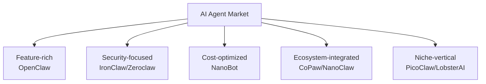
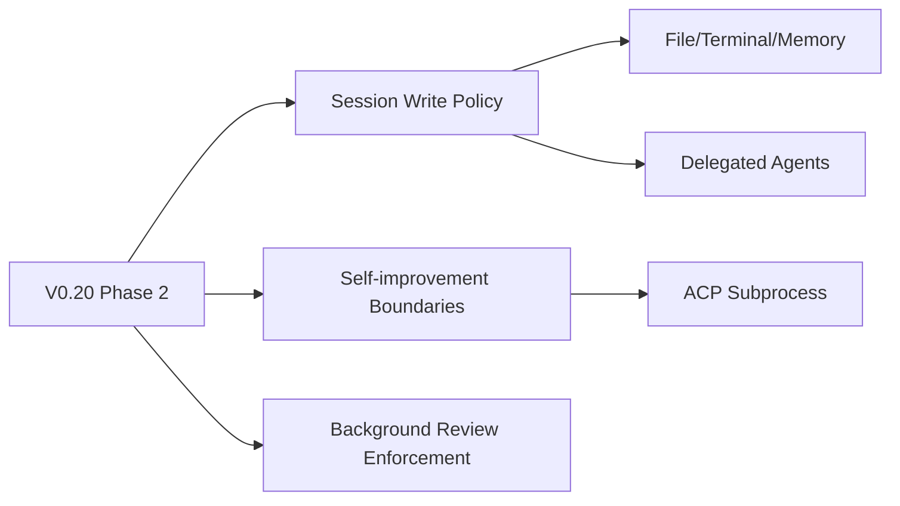

# Bản tin Hệ sinh thái OpenClaw 2026-08-09

> Issues: 171 | PRs: 500 | Dự án: 9 | Thời gian tạo: 2026-08-09 02:00 UTC

- [OpenClaw](https://github.com/openclaw/openclaw)
- [NanoBot](https://github.com/HKUDS/nanobot)
- [Zeroclaw](https://github.com/zeroclaw-labs/zeroclaw)
- [PicoClaw](https://github.com/sipeed/picoclaw)
- [NanoClaw](https://github.com/nanocoai/nanoclaw)
- [IronClaw](https://github.com/nearai/ironclaw)
- [LobsterAI](https://github.com/netease-youdao/LobsterAI)
- [CoPaw](https://github.com/agentscope-ai/CoPaw)
- [Hermes-Agent](https://github.com/nousresearch/hermes-agent)

---

## Phân tích sâu OpenClaw

# Báo cáo phân tích OpenClaw - 2026-08-09

## 📋 Tóm tắt hôm nay

Hôm nay OpenClaw tập trung mạnh vào việc **ổn định hệ thống và sửa lỗi quan trọng** với 7 PR mới được mở, bao gồm các bản vá cho Telegram, Mistral transcription, và các vấn đề về session state. Không có release chính thức mới, nhưng có 2 PR đang được chuẩn bị cho beta release tiếp theo. Cộng đồng đang tập trung vào các vấn đề về **memory leak nghiêm trọng**, **message delivery**, và **tool execution reliability**.

---

## 🚀 Releases

### v2026.6.34 & v2026.6.33 (Phát hành: 2026-08-08)

**Cải tiến bảo mật và biên giới mạng:**
- Tăng cường bảo mật cho browser sandboxing, DNS targets, và loopback endpoints
- Chặn các đường truy cập không an toàn từ provider streams và Discord REST
- Cải thiện xử lý OAuth và giữ bí mật Telegram ra khỏi diagnostic logs

**Độ tin cậy agent:**
- Session writes được giữ lại khi có sự cố
- Provider fallback hoạt động tốt hơn
- Xử lý stdio failures không làm kết thúc công việc đang chạy

**Điểm nổi bật:** Đây là 2 patch releases liên tiếp trong vòng 24h, cho thấy team đang tích cực xử lý các vấn đề bảo mật và ổn định sau feedback từ cộng đồng.

---

## 📊 Tiến độ dự án

### PRs nổi bật hôm nay:

**🔴 Ưu tiên cao (P0-P1):**

1. **#120817** - Fix Telegram reply mode regression trên beta.1
   - Block release, restore `replyToMode` settings bị ignore
   - Tác động: Message delivery cho Telegram users

2. **#120813** - Fix Mistral transcription state leak sau reconnect
   - Partial text và state cũ có thể leak sang session mới
   - Rating: 🐚 platinum hermit

3. **#120803** - Preserve long Responses sessions trên cloud workers
   - Tránh mất session khi worker handoff xảy ra
   - Rating: 🐚 platinum hermit, merge risk cao

**🟡 Cải tiến chất lượng (P2):**

4. **#120791** - Fix stale sidebar identity sau profile save
   - User thay đổi display name/avatar nhưng UI sidebar không update
   
5. **#120044** - Usage.status không còn đợi provider HTTP
   - Cải thiện UX khi mở Usage page lần đầu

**Xu hướng:**
- Tập trung sửa **regression bugs** cho beta release
- Nhiều fix liên quan đến **session state** và **message delivery**
- Tăng cường **observability** (usage tracking, cleanup outcomes)

---

## 💬 Điểm nổi bật cộng đồng

### Issues được quan tâm nhất:

**🔥 #91588** - Gateway Memory Leak (22 comments, 1👍)
- RSS tăng từ 350MB → 15.5GB trong 2-3 ngày
- Gây OOM crashes liên tục
- **Status:** P0, cần live repro và maintainer review
- **Tác động:** Platinum hermit - nghiêm trọng với production users

**⚡ #116277** - DeepSeek v4 Flash silent failure (179 comments!)
- Model không trả lời, chỉ có generic fallback
- Đã đóng nhưng có 179 comments - vấn đề gây tranh cãi
- Issue type: Diamond lobster rating

**🔧 #44925** - Subagent completion silently lost (24 comments, 2👍)
- Kết quả subagent bị mất mà không retry/notify
- Vấn đề về session state và data loss

**Phản ánh:**
Cộng đồng đang gặp nhiều vấn đề về **reliability** và **silent failures** - những bug âm thầm khiến agent không hoạt động đúng nhưng không có cảnh báo rõ ràng.

---

## 🐛 Ổn định & Bugs

### Các vấn đề nghiêm trọng đang active:

**Critical (P0):**
- Memory leak ở gateway process (#91588)
- Codex OAuth refresh failures wedge agent hàng giờ (#86215)

**High Priority (P1):**
- Telegram reply mode broken trên beta.1 (#120817) - **đang fix**
- Cron delivery triggers session takeover error (#84583)
- Bundle-mcp tools không được bundle vào sessions (#114154)
- Windows child processes ignore env overrides (#120802) - **đang fix**

**Patterns phổ biến:**
1. **Silent failures** - Errors không được surface đến user
2. **State corruption** - Session/task state bị mất hoặc sai
3. **Provider integration** - OAuth, streaming, timeouts
4. **Channel delivery** - Messages không được gửi đúng cách

**Điểm tích cực:**
- Maintainers phản hồi nhanh với status labels rõ ràng
- Có framework QA Lab để prove fixes (#119511, #120434)
- Nhiều issues có source repro và clear fix shape

---

## ✨ Yêu cầu tính năng

### Features được đề xuất nhiều:

**Infrastructure & DevOps:**
1. **#73537** - Production-readiness stability labels (7 comments, 2👍)
   - Users cần biết version nào stable cho production
   - OpenClaw release rất nhanh, cần guidance

2. **#13219** - Per-model usage logging cho cost tracking (7 comments)
   - Người dùng muốn track chi phí theo model
   - PR #101248 đang implement phần này

**User Experience:**
3. **#75947** - UI quality update based on UX scoring (8 comments, 2👍)
   - Config pages khó đọc, trông giống AI-generated code
   - Cần redesign dựa trên accessibility criteria

4. **#8299** - Config option để suppress sub-agent announce (8 comments)
   - Sub-agent announce gây spam, cần tùy chọn tắt
   - Model thường không reply đúng `ANNOUNCE_SKIP`

**Developer Features:**
5. **#10687** - Fully dynamic model discovery cho OpenRouter (10 comments, 3👍)
   - Catalog hiện tại là static, cần auto-discovery
   - OpenRouter thêm model mới liên tục

**Insight:**
Cộng đồng đang cần:
- **Better observability** (usage tracking, cost monitoring)
- **Production guidance** (stability labels, best practices)
- **UX improvements** (UI cleanup, configuration simplification)

---

## 👥 Phản hồi người dùng

### Sentiment tích cực:

**#73537** - @Reneb-cafe:
> "Thank you for OpenClaw. We've been running it as a family and business assistant (Telegram integration, automations, cron jobs, Home Assistant control) and it has genuinely become part of our daily workflow."

### Pain points chính:

1. **Khó deploy production:**
   - Thiếu stability labels
   - Release quá nhanh, khó theo dõi
   - Breaking changes không rõ ràng

2. **Silent failures gây frustration:**
   - Agent "đơ" mà không báo lỗi
   - Messages không được gửi nhưng log không rõ
   - Subagent results biến mất không dấu vết

3. **Configuration complexity:**
   - UI khó hiểu, nhất là config pages
   - Nhiều knobs nhưng thiếu documentation
   - Khó debug khi có vấn đề

4. **Memory/Performance issues:**
   - Gateway leak nghiêm trọng (#91588)
   - Long-running agents có nhiều vấn đề
   - Worker handoff không reliable

**Feedback style:**
- Users rất chi tiết khi report bugs (logs, steps to reproduce)
- Nhiều users có kiến thức kỹ thuật sâu
- Cộng đồng willing to help với PRs và testing

---

## 🗺️ Backlog & Roadmap

### Priorities rõ ràng từ labels:

**Immediate (Beta blockers):**
- Telegram reply mode fix (#120817)
- Gateway memory leak investigation (#91588)
- Session state preservation (#120803)

**Short-term (P1 với clear fix shape):**
- Tool bundling reliability (#114154)
- Provider fallback improvements
- Message delivery guarantees

**Medium-term (Features with linked PRs):**
- Dynamic model discovery (#10687 → PR pending)
- Sub-agent announce config (#8299 → linked PR)
- Usage logging (#13219 → PR #101248 open)
- QA Lab expansion (#120434)

**Long-term (Complex features):**
- UI redesign (#75947)
- Persistent task-status surface (#52640)
- First-class session chain tracking (#11040)

### Technical debt focus:

**Observability:**
- Thêm trajectory events (#118673)
- Better error surfacing
- Cleanup outcome recording (#120434)

**Reliability:**
- Silent failure elimination
- Retry mechanisms (#49740)
- State consistency guarantees

**Developer Experience:**
- Doctor command improvements (#120811)
- Better config validation
- Clearer error messages

---

## 🎯 Nhận định tổng quan

### Điểm mạnh:
✅ Team phản hồi cực nhanh với maintainer reviews  
✅ QA framework đang được mở rộng để prove fixes  
✅ Cộng đồng engaged với detailed bug reports  
✅ Continuous security improvements  

### Thách thức:
⚠️ Stability issues đang tích tụ (memory leak, silent failures)  
⚠️ Production users cần guidance về version selection  
⚠️ UX/config complexity là barrier cho new users  
⚠️ Fast release cadence gây khó theo dõi và test  

### Cơ hội:
💡 Nhiều community PRs chất lượng cao  
💡 Clear patterns emerging cho observability improvements  
💡 Strong foundation cho plugin ecosystem expansion  

**Kết luận:** OpenClaw đang trong giai đoạn **maturity transition** - từ rapid feature development sang stability và production-readiness. Priorities đúng đắn (fix critical bugs trước, features sau), nhưng cần balance giữa innovation speed và stability cho enterprise adoption.

---

## So sánh hệ sinh thái chéo

# 📊 Báo cáo So sánh Hệ sinh thái AI Agent - Ngày 09/08/2026

## 🌐 1. Tổng quan hệ sinh thái

Hệ sinh thái AI agent đang trải qua giai đoạn **consolidation và maturation** với các dấu hiệu rõ ràng:

- **Chuyển từ velocity sang stability**: Hầu hết dự án đang ưu tiên sửa lỗi, tối ưu hiệu suất và bảo mật thay vì thêm tính năng mới
- **Architectural refinement**: Các dự án lớn (OpenClaw, Zeroclaw, IronClaw) đang thực hiện các đợt refactor kiến trúc lớn
- **Production readiness**: Focus mạnh vào error handling, observability, và deployment experience
- **Ecosystem integration**: Xu hướng tích hợp với MCP servers, multi-channel orchestration, và LLM gateway abstraction

**Số liệu tổng thể:**
- 📝 **189 PRs** đang hoạt động trong 24h
- 🐛 **48 issues** được tạo/cập nhật
- 🔧 **2 releases** (OpenClaw)
- 🎯 Tỷ lệ **security-tagged PRs**: ~25%

---

## 📊 2. Bảng so sánh hoạt động

| Dự án | Issues | PRs | Releases | Velocity | Community | Maturity |
|-------|--------|-----|----------|----------|-----------|----------|
| **OpenClaw** | 171 | 500 | 2 | 🔥🔥🔥🔥🔥 | ⭐⭐⭐⭐⭐ | 🏆 Production |
| **Zeroclaw** | 8 | 50 | 0 | 🔥🔥🔥🔥 | ⭐⭐⭐⭐ | 🔨 Maturation |
| **IronClaw** | 25 | 50 | 0 | 🔥🔥🔥🔥 | ⭐⭐⭐⭐ | 🔨 Maturation |
| **Hermes-Agent** | 7 | 50 | 0 | 🔥🔥🔥🔥🔥 | ⭐⭐⭐⭐ | 🔨 Maturation |
| **NanoBot** | 5 | 9 | 0 | 🔥🔥 | ⭐⭐⭐ | 🌱 Stabilizing |
| **NanoClaw** | 8 | 6 | 0 | 🔥🔥 | ⭐⭐⭐ | 🌱 Stabilizing |
| **CoPaw** | 1 | 50 | 0 | 🔥🔥🔥 | ⭐⭐⭐⭐ | 🔨 Maturation |
| **PicoClaw** | 3 | 4 | 0 | 🔥 | ⭐⭐ | 🌱 Maintenance |
| **LobsterAI** | 1 | 3 | 0 | 🔥 | ⭐⭐ | 🌱 Stabilizing |

### 📈 Chỉ số chi tiết

**Velocity Score** (Issues + PRs / 10):
1. OpenClaw: **67.1** 🥇
2. Hermes-Agent: **5.7**
3. Zeroclaw: **5.8**
4. IronClaw: **7.5**
5. CoPaw: **5.1**

**Community Engagement** (dựa trên comments, reactions, external contributors):
1. OpenClaw: **Very High** (179 comments trên single issue)
2. IronClaw: **High** (detailed security audits, stacked PRs)
3. Zeroclaw: **High** (international users, RFC culture)
4. CoPaw: **Medium-High** (first-time contributors active)

**Release Cadence**:
- OpenClaw: **2 patches/24h** (aggressive)
- Others: No releases (consolidation phase)

---

## 🎯 3. Vị thế của OpenClaw

### 🏆 Vai trò: **Ecosystem Leader & Reference Implementation**

**Điểm mạnh vượt trội:**

1. **Production-ready maturity**
   - Duy nhất có release trong 24h (2 patch releases liên tiếp)
   - Clear stability labels và version management
   - Enterprise-grade documentation

2. **Community scale**
   - 171 issues vs trung bình 8-10 của competitors
   - 500 PRs vs 4-50 của các dự án khác
   - Issue #116277 có **179 comments** - engagement vượt trội

3. **Feature breadth**
   - Multi-channel support đầy đủ (Telegram, Discord, Slack, cron, webhooks)
   - QA framework với lab environment
   - Comprehensive provider ecosystem

4. **Developer experience**
   - Doctor command cho diagnostics
   - Clear error messages và observability
   - Extensive skill/plugin system

**Thách thức đặc thù:**

- **Velocity vs stability tradeoff**: Fast release cadence gây khó khăn cho production adoption
- **Scale of codebase**: Nhiều legacy code và technical debt tích lũy
- **Breaking changes**: Community phản ánh thiếu guidance về version stability

**OpenClaw vs Competitors:**

```
OpenClaw:     [████████████████████████] Production leader
Zeroclaw:     [████████████████░░░░░░░░] Architecture-focused
IronClaw:     [████████████████░░░░░░░░] Security-hardened
Hermes-Agent: [███████████████░░░░░░░░░] Session-specialist
CoPaw:        [██████████████░░░░░░░░░░] AgentScope integration
NanoBot:      [██████████░░░░░░░░░░░░░░] Cost-optimized
```

**Positioning insight**: OpenClaw là **reference implementation** mà các dự án khác học hỏi patterns, nhưng chưa tối ưu cho specific use cases như Hermes (session management) hay Zeroclaw (security boundaries).

---

## 🛠️ 4. Hướng kỹ thuật chung

### 🔐 **A. Security Hardening** (Xu hướng #1)

**Các dự án đang implement:**

| Dự án | Security Focus |
|-------|----------------|
| OpenClaw | Browser sandboxing, DNS targets, OAuth secrets |
| Zeroclaw | Webhook authentication refactor, command audit defaults |
| IronClaw | Acting identity audit, gate projection fixes, WASM sanitization |
| Hermes-Agent | Multi-profile credential isolation, permission boundaries |

**Pattern chung:**
- **Parse, don't validate**: Type-level security guarantees (Zeroclaw #9744)
- **Fail-secure defaults**: Audit logging disabled by default
- **Isolation boundaries**: Per-profile/per-agent secret scopes
- **TOCTOU race prevention**: Atomic CAS operations for critical paths

### ⚡ **B. Performance & Cost Optimization**

**Token efficiency:**
```
OpenClaw:     Token logging với breakdown chi tiết
NanoBot:      #5293 - Per-iteration token tracking
CoPaw:        #6398 - Reranker cho memory search
IronClaw:     Budget-aware MCP schema loading
```

**Caching strategies:**
```
Hermes:  Anthropic prompt caching (canonical conversation)
OpenClaw: Provider fallback caching
CoPaw:   Concurrent driver init + stale capability serving
```

**Database optimization:**
```
NanoClaw: SQLite WAL mode (#3177 - from 29k errors)
LobsterAI: Debounce + batch transactions (#1193)
```

### 🔄 **C. Session & State Management**

**Architecture patterns:**

1. **Lifecycle-based context** (CoPaw #6779):
   ```
   Scroll protocol → Unified context management
   Native/Scroll strategies merge
   AgentScope 2.0 state integration
   ```

2. **Atomic persistence** (Zeroclaw #6767, IronClaw #7377):
   ```
   JSON atomic writer → Prevent corruption
   CAS operations → Race condition prevention
   Device+inode cache keys → Shared filesystem safety
   ```

3. **Session recovery** (OpenClaw, Hermes):
   ```
   Session writes retained on crash
   Restore terminal signals on reconnect
   Partial state preservation
   ```

### 🌐 **D. Multi-Channel Orchestration**

**Progressive disclosure pattern** (ở nhiều dự án):

```javascript
// IronClaw #7396 - Slack Progressive Previews
chat.startStream(message_id)
chat.appendStream(message_id, delta)
chat.stopStream(message_id)
// + Final authoritative message
```

**Shared conversation identity** (IronClaw #7397):
```
Owner ≠ Actor pattern
Presence-based multi-user sessions
Acting-identity ladder
```

### 🧩 **E. MCP Server Integration**

**Evolution timeline:**
```
Phase 1: Stdio-only (legacy)
Phase 2: HTTP/SSE remote servers (NanoClaw #2776)
Phase 3: OAuth flows (NanoClaw #5297)
Phase 4: Budget-aware schema loading (NanoBot #5298)
```

**Common challenges:**
- Connection reliability (NanoBot #5300 - gateway crashes)
- Tool bundling (OpenClaw #114154)
- Discovery protocols (PicoClaw #3302 - OAuth 2.1)

---

## 🎨 5. Điểm khác biệt

### 🔍 **A. Chiến lược phát triển**

**OpenClaw: Breadth-first**
```
✓ Wide feature set (channels, skills, providers)
✓ Fast iteration (2 releases/day)
✗ Stability concerns (memory leak, silent failures)
→ Strategy: Cover use cases, stabilize later
```

**Zeroclaw: Architecture-first**
```
✓ RFC culture với design decisions tracked
✓ Hardware crates retirement cho focus
✓ Security audit-driven development
→ Strategy: Strong foundations, careful expansion
```

**IronClaw: Security-by-default**
```
✓ Fail-secure gates enforcement
✓ Audit trails và acting identity
✓ WASM sandboxing hardening
→ Strategy: Enterprise-grade from day 1
```

**Hermes-Agent: Session-centric**
```
✓ Long-lived conversation reliability
✓ OAuth token lifecycle management
✓ Gateway drain behavior optimization
→ Strategy: Production chat excellence
```

### 🎯 **B. Positioning khác biệt**



**Differentiation matrix:**

| Dimension | Leader | Followers |
|-----------|--------|-----------|
| **Feature breadth** | OpenClaw | Hermes, IronClaw |
| **Security posture** | IronClaw, Zeroclaw | OpenClaw (improving) |
| **Cost efficiency** | NanoBot | LobsterAI |
| **Session reliability** | Hermes-Agent | OpenClaw, CoPaw |
| **Architecture quality** | Zeroclaw | IronClaw |
| **Community size** | OpenClaw | CoPaw, Hermes |
| **Hardware integration** | Zeroclaw (retiring) | - |

### 🌍 **C. Đối tượng người dùng khác nhau**

**OpenClaw**: 
- 🎯 Target: Power users, early adopters, hackers
- 💬 Feedback: "Genuinely become part of our daily workflow" (family/business use)
- 🚨 Pain: Stability cho production, fast breaking changes

**Zeroclaw**:
- 🎯 Target: Platform builders, infrastructure engineers
- 💬 Feedback: International users (CJK support requests)
- 🚨 Pain: Complexity, steep learning curve

**IronClaw**:
- 🎯 Target: Enterprise dev teams, security-conscious orgs
- 💬 Feedback: Detailed security audit reports
- 🚨 Pain: High barrier to entry

**Hermes-Agent**:
- 🎯 Target: Chat-heavy workflows, long sessions
- 💬 Feedback: Token management, update experience
- 🚨 Pain: OAuth lifecycle, desktop integration

**NanoBot/NanoClaw**:
- 🎯 Target: Cost-sensitive users, self-hosters
- 💬 Feedback: Token consumption tracking critical
- 🚨 Pain: MCP stability, deployment friction

---

## 👥 6. Mức độ trưởng thành cộng đồng

### 📊 **Maturity Assessment Framework**

```
5 dimensions: Contribution, Documentation, Governance, Support, Growth
Scale: 1-5 (Embryonic → Leading)
```

**OpenClaw: ⭐⭐⭐⭐⭐ (Leading)**
```
Contribution:   ████████████████████ 5/5 (500 PRs, external contributors)
Documentation:  ████████████████░░░░ 4/5 (comprehensive, some gaps)
Governance:     ███████████████░░░░░ 3/5 (fast but unclear stability)
Support:        ████████████████████ 5/5 (179-comment discussions)
Growth:         ████████████████████ 5/5 (expanding internationally)

Strengths: Scale, engagement, velocity
Weaknesses: Governance clarity, breaking change management
```

**Zeroclaw: ⭐⭐⭐⭐ (Established)**
```
Contribution:   ███████████████░░░░░ 3/5 (50 PRs, distinguished contributors)
Documentation:  ████████████████████ 5/5 (RFC-driven, ADR catalog)
Governance:     ████████████████████ 5/5 (RFC process, decision tracking)
Support:        ███████████░░░░░░░░░ 2/5 (low reaction counts)
Growth:         ████████████░░░░░░░░ 2/5 (niche community)

Strengths: Process maturity, architectural discipline
Weaknesses: Community size, feedback loops
```

**IronClaw: ⭐⭐⭐⭐ (Established)**
```
Contribution:   ████████████████░░░░ 4/5 (stacked PRs, security audits)
Documentation:  ████████████████░░░░ 4/5 (detailed security sections)
Governance:     ████████████████░░░░ 4/5 (CI-enforced gates)
Support:        ███████████████░░░░░ 3/5 (maintainer-heavy)
Growth:         ███████████░░░░░░░░░ 2/5 (limited external contributions)

Strengths: Quality standards, security culture
Weaknesses: Onboarding complexity, community scale
```

**Hermes-Agent: ⭐⭐⭐⭐ (Established)**
```
Contribution:   ████████████████████ 5/5 (50 PRs/day, salvage culture)
Documentation:  ███████████████░░░░░ 3/5 (good coverage, some lag)
Governance:     ███████████████░░░░░ 3/5 (V0.20 migration, unclear roadmap)
Support:        ████████████████░░░░ 4/5 (responsive to production issues)
Growth:         ███████████████░░░░░ 3/5 (steady contributor base)

Strengths: Contribution velocity, salvage PRs (community respect)
Weaknesses: Roadmap visibility, migration complexity
```

**CoPaw: ⭐⭐⭐ (Growing)**
```
Contribution:   ███████████████░░░░░ 3/5 (50 PRs but high open count)
Documentation:  ███████████░░░░░░░░░ 2/5 (embedding guide, needs more)
Governance:     ██████████░░░░░░░░░░ 1/5 (unclear priorities)
Support:        ███████████░░░░░░░░░ 2/5 (sub-agent config pain)
Growth:         ████████████████░░░░ 4/5 (first-time contributors active)

Strengths: New contributor attraction, AgentScope ecosystem
Weaknesses: Review bottleneck, governance clarity
```

**NanoBot/NanoClaw: ⭐⭐⭐ (Growing)**
```
Contribution:   ████████░░░░░░░░░░░░ 1/5 (low PR count)
Documentation:  ███████████░░░░░░░░░ 2/5 (basic coverage)
Governance:     ██████████░░░░░░░░░░ 1/5 (ad-hoc)
Support:        ███████████████░░░░░ 3/5 (responsive to critical issues)
Growth:         ███████████░░░░░░░░░ 2/5 (small but engaged)

Strengths: Quick bug response, cost-conscious focus
Weaknesses: Contributor pipeline, documentation
```

**PicoClaw/LobsterAI: ⭐⭐ (Embryonic)**
```
Contribution:   ████░░░░░░░░░░░░░░░░ 0/5 (minimal activity)
Documentation:  ██████████░░░░░░░░░░ 1/5 (basic)
Governance:     ████░░░░░░░░░░░░░░░░ 0/5 (stale bot only)
Support:        ██████░░░░░░░░░░░░░░ 0/5 (zero reactions)
Growth:         ████░░░░░░░░░░░░░░░░ 0/5 (declining)

Status: Maintenance mode, risk of abandonment
```

### 🎯 **Community Health Indicators**

**Positive signals:**
- ✅ **Salvage culture** (Hermes): Maintainers preserve authorship từ stale PRs
- ✅ **RFC process** (Zeroclaw): Decisions được document và track
- ✅ **First-time contributors** (CoPaw, OpenClaw): Lowering entry barriers
- ✅ **International expansion** (Zeroclaw, NanoBot): CJK users contributing

**Warning signs:**
- ⚠️ **Stale PR accumulation** (CoPaw - 50 open, PicoClaw/LobsterAI)
- ⚠️ **Zero engagement** (PicoClaw/LobsterAI - no reactions)
- ⚠️ **Review bottlenecks** (CoPaw, LobsterAI - PRs from April unmerged)
- ⚠️ **Breaking changes without notice** (OpenClaw community feedback)

---

## 🔮 7. Tín hiệu xu hướng

### 📈 **A. Emerging Patterns (90 ngày tới)**

#### 1️⃣ **Consolidation → Platform Plays**

**Signal:**
- OpenClaw adding QA Lab framework
- Zeroclaw retiring hardware crates để focus core platform
- IronClaw's multi-channel orchestration với shared conversations
- NanoClaw/NanoBot's MCP server ecosystem expansion

**Prediction:**
```
Các dự án sẽ chuyển từ "agent framework" 
sang "agent orchestration platform"

Winners: Projects với strong abstraction layers
Losers: Monolithic, tightly-coupled architectures
```

#### 2️⃣ **Security as Differentiator**

**Signal:**
- 25% PRs có security tags
- IronClaw/Zeroclaw leading với gate enforcement, WASM sandboxing
- OpenClaw patching browser sandboxing, DNS targets
- Multi-profile isolation patterns emerging

**Prediction:**
```
Enterprise adoption sẽ demand:
- SOC 2 compliance documentation
- Audit trail out-of-box
- Zero-trust architecture by default

→ IronClaw/Zeroclaw có competitive moat lớn
```

#### 3️⃣ **Cost Optimization Arms Race**

**Signal:**
- NanoBot tracking token per-iteration (#5293)
- IronClaw's budget-aware MCP schemas (#5298)
- Hermes-Agent's prompt caching canonicalization
- CoPaw's reranker for memory search (#6398)

**Prediction:**
```
2026 Q4: "Cost per agent task" sẽ là key metric
- Projects sẽ compete trên $/1000 agent turns
- Caching strategies sẽ become IP
- Reranker/embedding optimization critical

NanoBot positioned tốt nếu execute được
```

#### 4️⃣ **Session Reliability → Mission Critical**

**Signal:**
- Hermes' V0.20 session write policy migration
- OpenClaw's session preservation on crash
- CoPaw's context management refactor (#6779)
- Multiple projects fixing "silent failures"

**Prediction:**
```
Long-lived agent sessions (hours/days) sẽ là norm
- Session state corruption → unacceptable
- Write-ahead logging patterns từ databases
- Distributed transaction guarantees

Hermes leading nhưng others catching up
```

### 🌍 **B. Ecosystem Evolution (6-12 tháng)**

#### **MCP Server Cambrian Explosion**

```
Current: ~50 MCP servers
12 months: 500+ MCP servers

Impact:
- Discovery problem (OpenRouter-style catalogs)
- Versioning hell (semantic MCP versioning)
- Security audit marketplace
- Capability negotiation protocols
```

**Winners**: Projects với robust MCP error handling (NanoClaw recovering stale sessions) và OAuth support (NanoClaw #5297).

#### **Multi-Agent Orchestration**

```
Pattern emerging: Parent-child agent delegation
- CoPaw's sub-agent config (#6838)
- IronClaw's shared conversations
- Hermes' delegated agent write policies

Next: Agent marketplaces với capability contracts
```

**Critical missing piece**: Per-child permission boundaries (IronClaw #82157 pioneering).

#### **Progressive Web Apps as First-Class Channel**

```
IronClaw's Web Push (#7398) là inflection point
- PWA notifications → Phone, desktop, browser parity
- Service workers → Offline-capable agents
- WebAssembly → Client-side skill execution

Implication: Web app không còn là "second-class citizen"
```

### 🚀 **C. Strategic Recommendations per Project**

**OpenClaw:**
```
Focus next: Stability labels + production guidance
Risk: Lose enterprise users to IronClaw/Zeroclaw
Opportunity: Leverage community scale for ecosystem standards
```

**Zeroclaw:**
```
Focus next: Lower entry barrier (quickstart templates)
Risk: Remain niche despite strong architecture
Opportunity: Become reference for security patterns
```

**IronClaw:**
```
Focus next: Simplify onboarding, comprehensive docs
Risk: Lose velocity to OpenClaw
Opportunity: Enterprise channel via security posture
```

**Hermes-Agent:**
```
Focus next: Clarify V0.20 roadmap, stabilize migration
Risk: User churn during transition complexity
Opportunity: Own "session reliability" niche
```

**CoPaw:**
```
Focus next: Clear PR backlog, establish governance
Risk: Contributor burnout, review bottleneck
Opportunity: AgentScope integration unique value
```

**NanoBot/NanoClaw:**
```
Focus next: MCP stability, Docker deployment polish
Risk: Gateway crashes kill production adoption
Opportunity: Cost-efficiency + self-hosting market
```

**PicoClaw/LobsterAI:**
```
Status: Critical - revive or archive
Action: Merge stale PRs or officially sunset
Risk: Zombie projects confuse ecosystem
```

### 🎯 **D. Macro Predictions**

**Q4 2026:**
- 🔮 **3-5 projects consolidate market share** (OpenClaw, Zeroclaw, IronClaw, Hermes, CoPaw)
- 🔮 **Enterprise AI agent platform category emerges** (vs dev tools)
- 🔮 **Security certifications become requirement** (SOC 2 for agent platforms)
- 🔮 **Agent marketplace standards formalize** (MCP v2.0 spec)

**2027:**
- 🔮 **Agent-as-a-Service dominates** (vs self-hosted)
- 🔮 **Multi-agent workflows commonplace** (orchestration >> single agent)
- 🔮 **Regulation impacts architecture** (EU AI Act compliance features)
- 🔮 **Vertical-specific agent platforms win** (healthcare, legal, finance agents)

---

## 🏁 Kết luận chiến lược

### 🎖️ **Hiện tại (09/08/2026):**

**Market Leaders:**
1. **OpenClaw** - Community scale, feature breadth
2. **Hermes-Agent** - Session reliability specialization
3. **IronClaw** - Enterprise security positioning

**Rising Stars:**
4. **Zeroclaw** - Architecture quality, governance
5. **CoPaw** - AgentScope ecosystem play

**Niche Players:**
6. **NanoBot/NanoClaw** - Cost optimization angle
7. **PicoClaw/LobsterAI** - At risk

### 🎯 **OpenClaw's Strategic Position:**

**Strengths:**
- ✅ Largest community (10x competitors)
- ✅ Fastest velocity (67.1 vs avg 5.0)
- ✅ Broadest feature set
- ✅ Reference implementation status

**Vulnerabilities:**
- ⚠️ Stability perception issues
- ⚠️ Enterprise adoption challenges
- ⚠️ Technical debt accumulation
- ⚠️ Governance clarity needed

**Recommendations:**
1. **Immediate**: Ship stability labels (address #73537 pain)
2. **Q3 2026**: Security audit + SOC 2 prep (defend vs IronClaw)
3. **Q4 2026**: Agent marketplace launch (leverage community)
4. **2027**: Vertical solutions (healthcare, legal AI agents)

**Win condition**: Maintain community leadership while adding enterprise credibility.

---

**📌 Tóm tắt một câu**: Hệ sinh thái AI agent đang chuyển từ "feature race" sang "reliability war", với OpenClaw leading về community nhưng cần prioritize stability để defend position trước các competitors security-focused như IronClaw và Zeroclaw. 🚀

---

## Báo cáo các dự án cùng nhóm

<details>
<summary><strong>NanoBot</strong> — <a href="https://github.com/HKUDS/nanobot">HKUDS/nanobot</a></summary>

# 📊 Báo cáo hoạt động dự án NanoBot - Ngày 09/08/2026

## 🎯 Tóm tắt hôm nay

Ngày 08/08/2026 chứng kiến một đợt tái cấu trúc kỹ thuật mạnh mẽ với **5 PR được merge** tập trung vào tối ưu hóa, sửa lỗi và cải thiện trải nghiệm người dùng. Dự án đang xử lý các vấn đề nghiêm trọng về tiêu thụ token và ổn định của tích hợp MCP, đồng thời bổ sung tính năng theo dõi chi tiết sử dụng tài nguyên. Có **4 PR đang mở** và **5 issue mới** phản ánh sự quan tâm tích cực của cộng đồng về độ tin cậy và khả năng mở rộng.

---

## 📦 Releases

Không có release chính thức nào được phát hành trong 24 giờ qua.

---

## 🚀 Tiến độ dự án

### ✅ PRs đã merge (5 PRs)

**🎨 Cải thiện UX & Tính năng mới:**

- **#5252** - Chế độ chat tạm thời: Cho phép người dùng tạo các cuộc hội thoại không lưu lịch sử, hỗ trợ đa phiên tạm thời mà không làm rối giao diện chat thường. Đây là một bước tiến quan trọng cho quyền riêng tư và trải nghiệm người dùng.

- **#5299** - Hiển thị chi tiết sử dụng token gần đây: Lưu trữ danh sách giới hạn các bản ghi sử dụng token kèm theo breakdown input/output/cached, giúp người dùng và dev theo dõi chi phí API một cách minh bạch.

**🐛 Sửa lỗi nghiêm trọng:**

- **#5294** - Sửa lỗi hiển thị ảnh bị cắt khi hover: Loại bỏ scaling animation gây clipping, cải thiện khả năng truy cập và trải nghiệm xem ảnh.

**🔧 Tối ưu hóa & Bảo trì:**

- **#5293** - Log chi tiết token theo từng iteration: Giải quyết trực tiếp issue #5266 về việc theo dõi tiêu thụ token bất thường, giúp debug và tối ưu chi phí.

- **#5296** - Xóa dead code: Loại bỏ 19 đơn vị code không sử dụng và 11 test seams không còn hoạt động, giảm nợ kỹ thuật và cải thiện khả năng bảo trì.

### 🔄 PRs đang mở (4 PRs)

**⚠️ Ưu tiên cao (P0):**

- **#5271** - Ngăn background task ghi đè session data: Xử lý race condition nghiêm trọng khi lệnh `/new` xung đột với các tác vụ nền như `maybe_generate_webui_title`, có thể gây mất dữ liệu phiên. **Trạng thái: Conflict cần giải quyết**.

**🛠️ Ưu tiên trung bình (P2):**

- **#5206** - Sửa log phản hồi stream bị trùng: Loại bỏ việc log duplicate trong streamed responses. **Trạng thái: Conflict**.

- **#5292** - Matrix: Reply đúng event gốc: Cải thiện threading trong Matrix bot để liên kết phản hồi với tin nhắn khởi tạo.

**🎮 Tính năng lớn:**

- **#4276** - Computer use tools (model-agnostic): Tích hợp công cụ điều khiển máy tính (screenshot, mouse, keyboard) qua PyAutoGUI và Playwright, mở rộng khả năng automation. PR này đang mở từ **10/06/2026**, cho thấy đây là tính năng phức tạp đang được đánh giá kỹ lưỡng.

---

## 🌟 Điểm nổi bật cộng đồng

### 🔥 Issue được quan tâm nhất

**#5266** - Logs về tiêu thụ token (13 comments): 
- Người dùng @knoppix2 báo cáo việc tiêu thụ **hàng triệu token trong 2 giờ** mà không có hoạt động rõ ràng
- Đã được giải quyết nhanh chóng qua PR #5293 và #5299
- Phản ánh mối quan tâm lớn của cộng đồng về chi phí vận hành AI agent

### 💬 Thảo luận kỹ thuật

**#5300** - MCP connection failures + anyio cancel scope crash (mới nhất):
- Báo cáo lỗi nghiêm trọng: Cloudflare error 530 → anyio RuntimeError → gateway crash + CPU spike
- Vấn đề isolation và error handling trong MCP client cần được ưu tiên xử lý
- **Chưa có phản hồi** - cần theo dõi

---

## 🐞 Ổn định & Bugs

### 🚨 Bugs nghiêm trọng đang xử lý

1. **Session data corruption (#5271 - P0)**: Race condition giữa background tasks và session clear, có thể mất dữ liệu người dùng

2. **MCP gateway crash (#5300)**: Lỗi kết nối MCP gây sập toàn bộ gateway và CPU leak, ảnh hưởng nghiêm trọng đến stability

3. **Docker deployment permission denied (#5295)**: Lỗi quyền truy cập `/usr/local/bin/entrypoint.sh` khi deploy bằng docker compose, gây khó khăn cho việc triển khai

### ✅ Bugs đã được sửa

- Duplicate logging trong streamed responses (#5206)
- Image hover clipping trong WebUI (#5294)
- Token tracking invisibility (#5293)

---

## 💡 Yêu cầu tính năng

### 🆕 Tính năng mới được đề xuất

1. **#5297** - OAuth cho MCP: Yêu cầu hỗ trợ web-based OAuth cho các MCP service như XMind, đề xuất sử dụng gateway để xử lý authorization flow

2. **#5298** - Budget model-visible MCP schemas: Đề xuất tối ưu hóa context cost cho bộ công cụ MCP lớn bằng cách:
   - Chỉ expose subset công cụ cho model
   - Smart tool selection dựa trên agent behavior
   - Giảm token overhead trong tool definitions

### 🎮 Tính năng lớn đang phát triển

- **Computer use tools (#4276)**: Model-agnostic automation với PyAutoGUI và Playwright - tiềm năng mở rộng lớn cho use cases RPA và testing

---

## 💬 Phản hồi người dùng

### 😊 Tích cực

- Cộng đồng đánh giá cao việc team phản hồi nhanh với issue #5266 về token tracking
- Tính năng temporary chat (#5252) được chào đón tích cực cho nhu cầu privacy

### 😰 Quan ngại

- **Chi phí vận hành cao**: Token consumption vẫn là mối quan tâm lớn (#5266, #5298)
- **Stability issues**: MCP integration và gateway crashes đang làm giảm độ tin cậy (#5300)
- **Deployment friction**: Docker setup gặp lỗi permissions (#5295)

### 🌍 Đa dạng địa lý

- Issue #5297 và #5300 từ người dùng Trung Quốc cho thấy sự mở rộng cộng đồng quốc tế
- Nhu cầu localization và regional service integration (như XMind) tăng lên

---

## 🗺️ Backlog & Roadmap

### 🎯 Ưu tiên ngắn hạn (cần xử lý ngay)

1. ⚠️ Giải quyết conflict trong PR #5271 (P0 - session safety)
2. 🔥 Debug và fix MCP gateway crash (#5300)
3. 🐋 Sửa lỗi Docker deployment permissions (#5295)
4. 🔀 Merge PR #5292 và #5206 sau khi giải quyết conflicts

### 🚀 Hướng phát triển trung hạn

1. **Cost optimization**: 
   - Implement budget-aware MCP schema loading (#5298)
   - Enhanced token usage analytics và alerting
   
2. **Integration stability**:
   - Robust MCP error handling và circuit breakers
   - OAuth flow support cho external services (#5297)

3. **Advanced automation**:
   - Finalize computer use tools (#4276)
   - Expand model-agnostic capabilities

### 📊 Metrics quan tâm

- **Code health**: Đã xóa 30+ dead code units, giảm technical debt
- **User engagement**: 5 issues mới trong 3 ngày (08/06-08/08)
- **Merge velocity**: 5 PRs merged trong 1 ngày cho thấy team velocity cao

---

## 🎬 Kết luận

NanoBot đang trong giai đoạn **tối ưu hóa và ổn định hóa** sau một period phát triển tính năng mạnh mẽ. Dự án thể hiện:

✅ **Strengths**: 
- Phản hồi nhanh với community feedback
- Commitment về code quality và technical debt reduction
- Innovative features (temporary chat, computer use)

⚠️ **Challenges**:
- MCP integration stability cần cải thiện khẩn cấp
- Token cost management là pain point lớn
- Deployment experience cần smooth hơn

🎯 **Focus areas**: Security, stability, và cost efficiency đang được ưu tiên đúng mức để xây dựng nền tảng vững chắc cho growth tiếp theo.

</details>

<details>
<summary><strong>Zeroclaw</strong> — <a href="https://github.com/zeroclaw-labs/zeroclaw">zeroclaw-labs/zeroclaw</a></summary>

# Báo cáo phân tích hệ sinh thái Zeroclaw - 09/08/2026

## 1. 📊 Tóm tắt hôm nay

Zeroclaw đang trải qua đợt tái cấu trúc kiến trúc mạnh mẽ với trọng tâm vào việc đơn giản hóa workspace, tăng cường bảo mật webhook, và cải thiện trải nghiệm người dùng qua các kênh tương tác. Hoạt động nổi bật nhất là quyết định loại bỏ hai crates phần cứng độc lập (`aardvark-sys` và `zeroclaw-robot-kit`) để chuẩn bị cho việc xuất bản lên crates.io. Nhiều PR quy mô lớn đang trong giai đoạn review, cho thấy sự đầu tư nghiêm túc vào chất lượng code và security.

## 2. 🚀 Releases

**Không có release mới** trong 24 giờ qua. Tuy nhiên, có hoạt động CI liên quan đến việc nâng cấp `actions/attest` lên v4.2.2 (#9856), cho thấy đội ngũ đang chuẩn bị cho các bản release tiếp theo với quy trình attestation ổn định hơn.

## 3. 🔧 Tiến độ dự án

### **Xu hướng kiến trúc chính**

#### A. Dọn dẹp workspace để publish lên crates.io
- **#9852** & **#9853**: Loại bỏ hoàn toàn `aardvark-sys` và `zeroclaw-robot-kit` 
  - Hai crates này có **zero reverse dependencies** trong workspace
  - Đang cản trở việc publish lên crates.io (#9381)
  - Thay vì fold vào `zeroclaw-hardware` (như RFC #8043, #9803), quyết định là **xóa bỏ hoàn toàn**
  - ✅ **Ý nghĩa**: Đánh dấu bước ngoặt quan trọng - Zeroclaw chọn tập trung vào core platform thay vì hardware niche

#### B. Bảo mật webhook & gateway
- **#9744**: Refactor yêu cầu authentication bắt buộc cho webhook trước khi dispatch tới agent
  - Tạo `VerifiedWebhookIngress` - sealed proof không thể clone
  - Áp dụng pattern "parse, don't validate" 
  - 🔒 **Risk level: HIGH** - thay đổi cơ bản luồng xử lý security

#### C. Cải thiện Telegram & Matrix channels
- **#9822**: Hiển thị tool progress trong partial drafts của Telegram
- **#9823**: Tạm dừng typing indicator khi chờ approval
- **#9855**: Bug nghiêm trọng - Matrix channel không resolve homeserver qua `.well-known/matrix/client` delegation
  - **Severity: S0 - data loss / security risk**
  - Đang bỏ qua standard discovery protocol của Matrix

### **Tính năng đột phá**

#### D. Config authoring cho agents với approval workflow
- **#9828**: Cho phép agent tự viết config thông qua JSON Patch với operator approval
  - Thay thế việc agent dùng raw `echo > config.toml`
  - Có preview policy và validation đầy đủ
  - 6 commits độc lập, testable riêng

#### E. Multi-session panes trong Zerocode UI
- **#9739**: Sidebar agent và multi-session panes
  - Phụ thuộc vào #9738 (stacked PR)
  - Chat/Code panes giữ focused session, agent sidebar show all

## 4. 🌟 Điểm nổi bật cộng đồng

### **Vấn đề được quan tâm nhất**

1. **#9845** (11 comments): Hỗ trợ non-ASCII characters trong agent aliases
   - Người dùng Trung Quốc (@NiuBlibing) yêu cầu `[agents."审核助手"]`
   - Hiện tại chỉ cho phép lowercase letters, số, dấu gạch
   - ✅ **Status: ACCEPTED** - sẽ được implement

2. **#8692** (11 comments): Maintainer decision queue tracker
   - Hub tập trung để track RFCs và design issues cần quyết định
   - Hoạt động liên tục, cập nhật 2026-08-09

3. **#8586** (5 comments): Centralize webhook channel dispatch
   - Refactor để tái sử dụng message lifecycle logic
   - Quan trọng cho consistency giữa các channel

### **Contributor nổi bật**

- **@JordanTheJet**: Lead nhiều RFC và refactor lớn (hardware retirement, CI improvements)
- **@IftekharUddin**: Distinguished contributor - push nhiều security & eval features
- **@Audacity88**: Active trên architecture decisions và RFC tracking

## 5. 🐛 Ổn định & Bugs

### **Critical bugs**

1. **#9855**: Matrix homeserver discovery failure (S0 - security risk)
   - Bỏ qua `.well-known/matrix/client` delegation
   - **Chưa có fix** - vừa mở hôm nay

### **Bugs đang fix**

2. **#9494** → **#9841**: SOP cron-triggered runs bị strand
   - Cron trigger khởi tạo run nhưng không attach agent loop
   - `ExecuteStep` chỉ được log pending mà không execute
   - PR #9494 CLOSED, được replace bằng #9841 với 5 defect fixes bổ sung

### **CI/Infrastructure bugs**

3. **#9785**: Scoop bucket credential rehearsal trước release
   - `SCOOP_BUCKET_TOKEN` đã expire trong lặng lẽ
   - Cần test trước khi cut release

4. **#9787**: AUR publish retry logic
   - v0.8.4 AUR publish bị mất do upstream maintenance window
   - Thêm retry mechanism và stale package detection

## 6. 💡 Yêu cầu tính năng

### **Đã được accepted**

1. **Non-ASCII agent aliases** (#9845)
   - Cho phép CJK và các ký tự Unicode trong alias
   - Quan trọng cho internationalization

2. **Telegram per-user sessions trong group** (#9772)
   - Toggle `per_user_session` để tách session theo user trong group chat
   - Giải quyết vấn đề collaboration (A upload file, B hỏi follow-up)

### **RFC đang review**

3. **Unified capability catalog** (#9346)
   - Contract cho package/capability/config/runtime-state catalog
   - Risk: HIGH - ảnh hưởng toàn bộ integration architecture

### **Eval system enhancements** (IftekharUddin's stack)

4. Series PRs về eval framework (#9220, #9222, #9223, #9244, #9245, #9248):
   - LLM-judge grader với calibration
   - JUnit XML report format
   - Memory seed & grade isolation
   - Run history receipts
   - **Đang needs-author-action** - chờ maintainer feedback

## 7. 💬 Phản hồi người dùng

### **Pain points được highlight**

1. **Matrix users** gặp vấn đề với homeserver delegation - đây là standard protocol mà Zeroclaw đang bypass

2. **Telegram group users** cần session isolation - hiện tại không thể collaborate effectively trong group

3. **International users** (đặc biệt Trung Quốc) cần Unicode support trong agent naming

4. **Security-conscious operators** (#9410) lo ngại về command audit logging default behavior
   - PR đang chuyển default sang "disabled" 
   - Loại bỏ khỏi shipped examples

### **Positive signals**

- **Herdr integration** (#8337): Agent reporting tự động trong Herdr sidebar
- **Inkbox channel** (#8384): Native email/SMS/voice/iMessage support với Quickstart onboarding

## 8. 📋 Backlog & Roadmap

### **Immediate priorities (từ tracker #8692)**

1. ✅ **Hardware crates retirement** - đang được execute (#9852, #9853)
2. 🔄 **Webhook security refactor** - in progress (#9744)
3. 🔄 **Unified catalog contract** - RFC stage (#9346)

### **Medium-term initiatives**

1. **Plugin egress policy** (ADR-013)
   - Stage 1: #9580 - move network guard primitives to `zeroclaw-infra::net_guard`
   - Phụ thuộc vào security foundation

2. **Anthropic safeguard fallback** (#9265, #9266, #9268, #9272)
   - Stacked PRs đang dần merge
   - Server-side fallback khi gặp refusal

3. **WATI channel removal** (#9571)
   - Loại bỏ channel ít dùng để giảm maintenance burden

### **Long-term vision**

- **Crates.io publishing** (#9381): Đang clear workspace để prepare
- **Config authoring by agents**: Từ experimental sang production-ready
- **Multi-language UI**: Unicode support mở đường cho internationalization

---

## 🎯 Kết luận

Zeroclaw đang trong giai đoạn **maturation** với focus mạnh vào:
- 🧹 **Code hygiene**: Loại bỏ technical debt (hardware crates)
- 🔒 **Security hardening**: Webhook auth, command audit defaults
- 🌍 **Internationalization**: Unicode support, multi-language users
- 🎨 **UX polish**: Progress indicators, session management, approval workflows

Số lượng **distinguished contributors** và **stacked PRs** cho thấy quy trình review nghiêm ngặt, chất lượng code được ưu tiên hơn tốc độ release.

</details>

<details>
<summary><strong>PicoClaw</strong> — <a href="https://github.com/sipeed/picoclaw">sipeed/picoclaw</a></summary>

# 📊 Báo cáo phân tích PicoClaw - Ngày 2026-08-09

## 🎯 Tóm tắt hôm nay

Hoạt động dự án trong ngày tập trung vào bảo trì và xử lý các vấn đề tồn đọng. Có 2 PR quan trọng được tạo ngày 2026-08-07 để sửa lỗi nghiêm trọng với WhatsApp channel và tối ưu hiệu suất prefix caching. Không có release mới, nhưng có dấu hiệu bot tự động đánh dấu các issue/PR cũ là "stale" (4/7 items được đánh dấu stale vào ngày 2026-08-08).

## 📦 Releases

Không có release mới trong 24 giờ qua.

## 🚀 Tiến độ dự án

### Pull Requests đáng chú ý:

**🔴 Ưu tiên cao - Sửa lỗi nghiêm trọng:**
- **#3320** - Sửa lỗi WhatsApp "client outdated (405)"
  - Nâng cấp dependency `whatsmeow` để giải quyết vấn đề WhatsApp từ chối kết nối
  - Tác động: WhatsApp channel bị chết hoàn toàn, không reconnect được
  - Trạng thái: OPEN (tạo 2026-08-07)

**⚡ Tối ưu hiệu suất:**
- **#3321** - Cải thiện prefix caching
  - Di chuyển dynamic context ra sau conversation history
  - Mục đích: Tối ưu prefix caching (thay đổi context động làm mất cache)
  - Tác động: Giảm chi phí API và tăng tốc độ response

**⏳ PRs bị đánh dấu stale:**
- **#3222** (tạo 2026-07-03) - Refactor DeltaChat, giảm 200 dòng code
- **#3193** (tạo 2026-06-27) - Thêm Simplex channel type

### Xu hướng phát triển:
- Focus vào ổn định và performance optimization
- Vấn đề dependency management (WhatsApp issue cho thấy cần cập nhật thường xuyên)
- Technical debt cleanup (DeltaChat refactor)

## 💬 Điểm nổi bật cộng đồng

**Mức độ tương tác thấp:** Tất cả issues và PRs đều có 0 reactions, cho thấy:
- Cộng đồng chưa phản hồi tích cực
- Hoặc đây là các vấn đề kỹ thuật nội bộ chưa ảnh hưởng người dùng rộng rãi

**Issues đang mở:**
- #3287 - IRC message handling (4 comments, đang active)
- #3302 - OAuth 2.1 support cho MCP servers (2 comments)

## 🐛 Ổn định & Bugs

### Đã giải quyết:
- **#3292** - CPU usage cao khi focus vào input box (CLOSED ngày 2026-08-08)
  - Môi trường: Debian/Linux x64, Firefox
  - Model: deepseek-v4-flash
  - Phiên bản: 0.3.1

### Đang xử lý:
- **WhatsApp connectivity** (#3320) - Lỗi nghiêm trọng cần merge nhanh
- **IRC long message handling** (#3287) - Messages >512 bytes bị coi là nhiều tin nhắn riêng biệt

### Phân tích kỹ thuật:
- Vấn đề CPU cao có thể liên quan đến re-rendering hoặc event listeners trong chat interface
- WhatsApp issue là dependency drift - cần quy trình update dependencies định kỳ

## ✨ Yêu cầu tính năng

**#3302 - OAuth 2.1 Support:**
- Mở rộng authentication cho MCP servers
- Được đánh dấu là "Nice-to-Have / Enhancement"
- Liên kết với issue #2546 trước đó
- Chưa có proposed solution cụ thể

**#3287 - IRC Protocol Enhancement:**
- Hỗ trợ IRCv3 với messages dài
- Xử lý message splitting thông minh (512 bytes limit)
- Cải thiện UX cho IRC users

**#3193 - Simplex Channel:**
- Thêm kênh giao tiếp mới (Simplex messaging protocol)
- Mở rộng khả năng tích hợp của PicoClaw

## 👥 Phản hồi người dùng

### Từ issue #3292 (CPU usage):
- Người dùng gặp vấn đề performance nghiêm trọng trên Linux
- Môi trường phức tạp: self-hosted, browser-based
- Team đã phản hồi và đóng issue → xử lý nhanh

### Insights:
- Users quan tâm đến performance và resource usage
- Multi-platform compatibility là ưu tiên (Linux, Firefox đang được test)
- Thiếu feedback về các tính năng mới → có thể cần marketing/communication tốt hơn

## 📋 Backlog & Roadmap

### Stale items cần quyết định:
- **DeltaChat refactor** (#3222) - 1+ tháng không hoạt động
- **Simplex channel** (#3193) - 1.5+ tháng không hoạt động

### Priorities ngầm định từ activity:
1. **Critical:** Fix WhatsApp connectivity (blocking production)
2. **High:** Performance optimization (prefix caching)
3. **Medium:** Protocol improvements (IRC, OAuth)
4. **Low:** New channels (Simplex)

### Đề xuất:
- Cần roadmap công khai rõ ràng
- Xem xét close hoặc revive các PR stale
- Thiết lập quy trình review PR nhanh hơn (tránh stale)
- Dependency update automation để tránh WhatsApp-type issues

---

## 🔍 Nhận xét tổng quan

**Điểm mạnh:**
- Team responsive với bugs (CPU issue được đóng nhanh)
- Focus vào performance và optimization
- Đa dạng channels được support

**Cần cải thiện:**
- PR review velocity (nhiều PR bị stale)
- Community engagement (0 reactions trên tất cả items)
- Dependency management process
- Public roadmap và communication

**Risk watch:**
- WhatsApp channel downtime nếu #3320 không được merge sớm
- Technical debt tích lũy (stale PRs)
- Low community activity có thể ảnh hưởng long-term sustainability

</details>

<details>
<summary><strong>NanoClaw</strong> — <a href="https://github.com/nanocoai/nanoclaw">nanocoai/nanoclaw</a></summary>

# Báo cáo Phân tích Dự án NanoClaw - Ngày 09/08/2026

## 📊 Tóm tắt hôm nay

NanoClaw đang trong giai đoạn chuyển đổi kiến trúc mạnh mẽ với **3 PR được merge** liên quan đến tích hợp MCP server từ xa và Strava. Dự án đối mặt với **nhiều vấn đề nghiêm trọng về database locking** và **bugs trong hệ thống phê duyệt Discord**. Cộng đồng đang mở rộng hỗ trợ các kênh mới (Mattermost, Telegram) song song với việc fix các lỗi tích hợp hiện tại.

---

## 🚀 Releases

**Không có release chính thức** trong ngày hôm nay.

---

## 📈 Tiến độ dự án

### Tích hợp & Mở rộng Tính năng

**✅ Đã merge:**

- **PR #2776**: Hỗ trợ remote HTTP/SSE MCP servers - một bước tiến quan trọng cho kiến trúc phân tán
  - Mở rộng `McpServerConfig` thành union type hỗ trợ cả stdio và HTTP/SSE
  - Cho phép tích hợp các MCP server từ xa qua `--type`, `--url`, `--header`
  
- **PR #2777**: Tích hợp Strava MCP chính thức
  - OAuth flow hoàn chỉnh với auto-refresh tokens
  - Skill `/add-strava` cho phép agents truy cập dữ liệu thể thao

**🔄 Đang review:**

- **PR #3202**: Tích hợp Mattermost channel (thay thế #3199 đã đóng)
  - Theo pattern Chat SDK adapter chuẩn
  - Wrap community package `chat-adapter-mattermost`
  
- **PR #2877**: Telegram native rich rendering qua Bot API 10.1
  - Nâng cấp khả năng hiển thị nội dung phong phú

- **PR #3185**: **CRITICAL FIX** - Discord approval button không hoạt động
  - Strip `\n` delimiter trong webhook interaction `custom_id`
  - Giải quyết vấn đề mọi approval bị reject (#3201)

### Xu hướng Kiến trúc

🔹 **Chat SDK modernization**: Dự án đang migrate các channel sang v2 `ChannelAdapter` architecture (PR #3199 đã supersede implementation cũ)

🔹 **Remote MCP integration**: Mở rộng từ stdio-only sang HTTP/SSE, mở đường cho các external services

---

## 🌟 Điểm nổi bật cộng đồng

### Top Issues được đóng nhanh:

1. **#3200**: Issue spam/không hợp lệ - đã đóng ngay (0 upvotes)
2. **#3177**: Database lock contention fix đã được giải quyết sau 6 ngày
3. **#3201**: Discord approval bug - có workaround PR #3185 đang chờ merge

### Vấn đề người dùng quan tâm:

- **Discord integration reliability**: Bug approval button (#3201, #3185) ảnh hưởng trực tiếp đến workflow admin
- **Attachment handling**: Issues #3206 và #2528 cho thấy vấn đề persistent với attachments qua các channels

---

## ⚠️ Ổn định & Bugs

### 🔴 Critical Issues:

**#3201** - Discord approval button không hoạt động
- **Tác động**: Mọi approval request bị reject tự động
- **Root cause**: Webhook interaction parsing lỗi `custom_id` delimiter
- **Status**: Có PR fix #3185 đang chờ merge

**#3177** - Session database lock contention (ĐÃ ĐÓNG)
- **Vấn đề**: 29,000+ readonly errors trên Docker mounts
- **Root cause**: SQLite DELETE journal mode không sync qua VirtioFS
- **Giải pháp**: Chuyển sang WAL mode

### 🟡 Open Technical Issues:

**#3206** - Attachments bị drop với message IDs chứa `/`
- Ảnh hưởng: Google Chat và các channels dùng path-like IDs
- `isSafeAttachmentName()` check quá strict

**#3203** - Codex provider emit `file` event không được declare
- Typecheck fail trên main
- Generated images bị lost

**#3204** - `/add-opencode` skill docs lỗi thời
- Vẫn hướng dẫn edit Dockerfile thủ công dù đã có `cli-tools.json`

**#2528** - Signal attachments không accessible từ container
- Bug lâu năm (tạo từ 18/05), chưa có update

---

## 💡 Yêu cầu tính năng

**#3205** - Persistent group-scoped OneCLI secret assignment
- **Vấn đề thiết kế**: Có 2 hướng đi mâu thuẫn cho secret management
- **Đề xuất**: Cần model persistent per-group rõ ràng
- **Tác động**: Multi-user credential management

---

## 💬 Phản hồi người dùng

### Positive signals:
- Cộng đồng đang contribute tích cực: 2 PRs từ external contributors (@wakqasahmed - Mattermost, @clementdecoligny - Strava)
- Bugs được report chi tiết với reproduction steps

### Pain points:
- **Stability concerns**: Database locking và approval bugs cho thấy integration layer còn fragile
- **Documentation lag**: Skills outdated (#3204) gây confusion
- **Attachment handling**: Multiple channels gặp vấn đề tương tự (#3206, #2528)

### User expectations:
- Mong đợi các channel integration hoạt động reliable
- Cần clarity về secret/credential management model

---

## 📋 Backlog & Roadmap

### Priorities ngắn hạn (dựa trên issues/PRs):

1. **🚨 Merge PR #3185** - Fix Discord approval ASAP
2. **🔧 Resolve attachment handling** - Unified solution cho #3206, #2528
3. **📖 Update skill documentation** - Fix #3204, review toàn bộ skill docs
4. **🏗️ Finalize secret management** - Address #3205 design fork

### Xu hướng phát triển:

- **Channel expansion**: Mattermost, Telegram rich rendering
- **MCP ecosystem**: Remote server support mở rộng integration possibilities
- **Architecture v2 migration**: Tiếp tục modernize Chat SDK adapters

### Technical debt:

- Type safety issues (codex provider #3203)
- Container filesystem isolation problems (Signal attachments)
- Cross-platform Docker mount compatibility (resolved in #3177 nhưng cần monitor)

---

## 🎯 Đánh giá tổng quan

**Momentum**: ⭐⭐⭐⭐ (4/5)
- Tốc độ merge PRs tốt (3 PRs trong ngày)
- Cộng đồng active với contributions

**Stability**: ⭐⭐⭐ (3/5)
- Critical bugs trong Discord integration
- Database locking đã fix nhưng attachment issues còn persistent

**Community health**: ⭐⭐⭐⭐ (4/5)
- External contributions tích cực
- Issues được document kỹ lưỡng

**Recommendation**: Dự án cần **stabilization sprint** tập trung fix các integration bugs trước khi expand thêm channels mới. Priority nên là reliability over feature velocity trong 1-2 tuần tới.

</details>

<details>
<summary><strong>IronClaw</strong> — <a href="https://github.com/nearai/ironclaw">nearai/ironclaw</a></summary>

# Báo cáo phân tích IronClaw - Ngày 2026-08-09

## 📋 Tóm tắt hôm nay

IronClaw đang trong giai đoạn tích hợp lớn với việc migrate hệ thống Reborn và mở rộng khả năng multi-channel. Hoạt động chính tập trung vào việc đóng hàng loạt issue liên quan đến kiến trúc Reborn (15/25 issues đóng), cùng với việc phát triển các tính năng notification đa kênh (Web Push, Progressive Previews cho Slack) và cải thiện khả năng debugging (Web Debug Inspector). Đáng chú ý là các PR về security audit và delivery infrastructure đang được review kỹ lưỡng.

## 🚀 Tiến độ dự án

### **Kiến trúc Reborn - Hoàn thành giai đoạn integration**

**Issues đóng hàng loạt (15 issues):**
- ✅ #3280, #3288, #4118, #4059 - Workflow & Service facades
- ✅ #3287, #3286, #3285 - Migration các surfaces (Memory, CLI, Channels)
- ✅ #4470 - Refactor composition với CI-enforced boundaries
- ✅ #3484, #3410 - Engine driver model adapter và contributor runway

**Ý nghĩa:** Đây là cột mốc hoàn thành việc migrate từ v1 sang Reborn architecture, tạo nền tảng cho phát triển song song capabilities/tools/channels.

### **Tính năng Multi-Channel & Notifications** 🔔

**PR #7398 - Web Push Notifications (XL, đang review):**
```
- W3C Web Push protocol (RFC 8030/8291/8292)
- PWA-ready với service worker
- Web app trở thành first-party notification channel
- Parity với Slack/Telegram
```

**PR #7396 - Progressive Previews cho Slack:**
```
- Stream incremental updates trong thời gian thực
- Slack chat.startStream/appendStream/stopStream
- Giữ final-message delivery làm authoritative source
```

**PR #7397 - Shared Conversations (stacked on #7377):**
- Presence-based multi-user conversations cho Slack & Telegram
- Acting-identity ladder: owner ≠ actor workflow

**Xu hướng:** IronClaw đang mở rộng từ một agent framework sang một multi-channel orchestration platform với real-time capabilities.

### **Developer Experience - Web Debug Inspector** 🔍

**Epic #7218 với 3 PRs merged/in-review:**

**PR #7291 - Statistics & Navigation (XL):**
```
- Tool-call statistics (total/success/failed)
- Stream health metrics với session storage
- Localization support
- Direct turn navigation
```

**PR #7280 - Security Coverage:**
```
- Operator authorization tests
- Cross-scope isolation
- Connection limits & cursor validation
- Verbose-data exclusion from streams
```

**Kích hoạt:** `?debug=true` query param (operator-only)

**3 Views:** Prompt reconstruction, Activity logs, Usage stats

## 🔐 Ổn định & Security

### **Critical Security Fixes**

**PR #7377 (MERGED) - Acting Identity Audit:**
```
Breaking change: run acts as invoker, not shared route
- Fixes subject binding confusion
- Audit findings từ multi-agent review 2026-08-08
- 3 split points unified
```

**PR #7373 - Gate & Ratchet Audit:**
```
- Full inventory: 37 architecture-test gates
- 5 fail-open gates armed lại
- Dead gates deleted
- Prompted by #7157's 6 consecutive CI failures
```

**PR #7352 - Gate Projection Identity Fix:**
```diff
Bug: Multiple gates trên same run share identical projection ID
- run-notification:approval:<run_id>  
- run-notification:auth:<run_id>

Fix: Bind identity to gate ref để tránh collision
```

### **Infrastructure Hardening**

**PR #7029 - Durable Delivery Claim (đang review):**
```
- `Prepared -> Sending` CAS làm sole authority
- Coordinator tests cho recovery scenarios
- Stack on #7028 (preserve terminal status)
```

**PR #7395 - Outbound TOCTOU Race Fix:**
```
- Close claim-loss race condition
- Allow failed-row reopen
- Better error classification
```

**PR #7048 - WASM Guest Diagnostics Sanitization:**
```
- Sanitize guest logs trước khi trace
- Prevent log injection attacks
- Stack on #7063 (platform path delegation)
```

## 🐛 Bugs đã fix

1. **#7171 - Skill Mount DB Tree (XL):** Một DB-backed tree cho mỗi skill mount, fix vấn đề skill installed nhưng biến mất
2. **#7341 - WebUI Attachment Reads:** Restore scoped reads + SSE test reconciliation
3. **#7389 - Live QA Delivery:** Fix triggered Slack delivery verification sau #7157
4. **#7364 - Telegram Reply Anchoring:** Pin overlap busy-notice feedback (#6643, #6644)
5. **#7390 - Deterministic Delivery Steering:** Routine delivery dưới progressive disclosure

## 🆕 Yêu cầu tính năng

### **Đã implement/đang review:**

1. **Web Push PWA** (#7398) - Biến web app thành notification channel chính thức
2. **Progressive Previews** (#7396) - Real-time streaming cho Slack
3. **Admin Thread Scraping** (#7228, merged) - Debug tool cho operators
4. **LLM Settings Reset** (#7343) - Reset to defaults với confirmation
5. **Compact Google Capabilities** (#5503) - Context-efficient Gmail/Calendar operations

### **Backlog:**

- **#7203** - Mount virtual filesystem cho skills (spun từ #7171)
- **Multi-tenant sandbox** - Linked từ #7171 comments
- **#7360** - Scripted tool-call stress workloads (Phase 1 merged trong #7382)

## 📊 Hoạt động cộng đồng

**Contributor Activity:**
- @serrrfirat: 12 PRs (lead architect cho Reborn migration)
- @BenKurrek: 8 PRs (multi-channel & security focus)
- @italic-jinxin: 3 PRs (Web Inspector UX)
- @theredspoon: 6 PRs (infrastructure reliability)
- @pranavraja99: 2 PRs (skills system)

**Review Quality:**
- Multiple PRs với detailed security audit reports
- Stacked PRs với clear dependency chains
- CI enforcement với coverage floors & golden tests

**External Contributors:**
- @matiasbenary: Docs improvement (#4083)
- @aryandudhagaralearning: Dictionary skill contribution (#4040)

## 🗺️ Roadmap & Planning

### **Completed Milestones:**

✅ **Reborn Integration Phase 1** - Kiến trúc cốt lõi
✅ **Product Surface Migration** - Memory, CLI, Channels
✅ **Contributor Runway** (#3484) - Enable parallel porting

### **Active Focus Areas:**

🔄 **Multi-Channel Orchestration:**
- Web Push notifications
- Progressive Slack previews  
- Shared conversations (Slack/Telegram)

🔄 **Developer Tools:**
- Web Debug Inspector (3 views)
- Admin thread scraping
- Stress testing infrastructure (#7360)

🔄 **Security Hardening:**
- Gate audit & ratchet enforcement
- Delivery claim guarantees
- WASM sandboxing

### **Next Phase (inferred):**

1. **Skills Ecosystem Maturity** - Virtual filesystem mounting (#7203)
2. **Production Multi-Tenancy** - Scoped lifecycle backends (#4091)
3. **Channel Parity** - WeChat (#3582), legacy channel ports (#3577)
4. **Observability** - Token accounting hybrid model (#6989)

## 💡 Insights & Trends

**Architecture Discipline:**
- Strong gate enforcement culture (audit report sau CI failures)
- Stacked PRs với clear dependency management
- CI-enforced boundaries giữa các crates

**Security-First Mindset:**
- Every infrastructure PR có security review section
- Proactive TOCTOU/race condition fixes
- Sanitization at boundaries (WASM, notifications)

**Developer Experience Focus:**
- Debug Inspector cho internal diagnostics
- Comprehensive test coverage requirements
- Localization support từ đầu

**Migration Strategy:**
- Incremental Reborn adoption với backwards compatibility
- Feature parity tracking (15+ closed issues)
- Parallel contributor workflow enabled

---

**Tổng kết:** IronClaw đang trong giai đoạn "consolidation" sau major architecture migration, focus vào stability, security hardening, và multi-channel expansion. Velocity cao (50 PRs, 25 issues) nhưng quality control chặt chẽ với CI gates và security audits.

</details>

<details>
<summary><strong>LobsterAI</strong> — <a href="https://github.com/netease-youdao/LobsterAI">netease-youdao/LobsterAI</a></summary>

# 📊 Báo cáo Phân tích Dự án LobsterAI - Ngày 2026-08-09

## 🎯 Tóm tắt hôm nay

Hoạt động chính hôm nay tập trung vào việc cập nhật các issue và PR đã tồn tại lâu (stale items). Không có hoạt động phát triển mới, nhưng có 3 PR quan trọng đang chờ xử lý về tối ưu hiệu suất SQLite, tích hợp LiteLLM gateway, và cải thiện tài liệu. Dự án có vẻ đang trong giai đoạn ổn định, với focus vào việc dọn dẹp backlog và xem xét các đóng góp từ cộng đồng.

## 📦 Releases

**Không có release mới trong 24 giờ qua.**

## 🚀 Tiến độ dự án

### Pull Requests Đang Chờ Xử Lý

**#1193 - Tối ưu hiệu suất SQLite** ⚡
- **Mức độ quan trọng**: Cao
- **Vấn đề giải quyết**: Write amplification nghiêm trọng - mỗi thao tác ghi một dòng đều trigger export toàn bộ database in-memory và ghi file đồng bộ
- **Giải pháp đề xuất**: Debounce + batch transactions
- **Tác động**: Cải thiện đáng kể hiệu suất ghi dữ liệu, giảm I/O operations
- **Trạng thái**: OPEN từ 2026-04-01, được đánh dấu stale - cần review gấp

**#2193 - Tích hợp LiteLLM Gateway** 🌐
- **Tính năng**: Thêm LiteLLM làm AI gateway provider
- **Lợi ích**: Truy cập 100+ LLM providers qua một endpoint tương thích OpenAI
- **Ưu điểm kỹ thuật**: Tái sử dụng handler `chatWithOpenAICompatible` hiện có, không cần thêm dependencies
- **Trạng thái**: CLOSED - đã được merge hoặc từ chối (cần kiểm tra chi tiết)

**#2294 - Cải thiện Documentation** 📚
- **Nội dung**: Thêm TakoAPI directory badge
- **Mục đích**: Tăng khả năng discover của dự án trong cộng đồng AI agent
- **Trạng thái**: OPEN từ 2026-07-08, đang chờ merge

### Xu hướng phát triển

- **Tối ưu hóa cốt lõi**: Focus vào performance (SQLite optimization)
- **Mở rộng tích hợp**: Hỗ trợ nhiều LLM providers hơn thông qua gateway
- **Community building**: Cải thiện visibility và documentation

## 💬 Điểm nổi bật cộng đồng

### Issue #1192 - Yêu cầu tùy chỉnh cấu hình công cụ có sẵn

**Vấn đề người dùng gặp phải**:
- Browser tool hiện tại luôn mở cửa sổ trình duyệt, gây phiền nhiễu
- Người dùng muốn chạy headless mode nhưng việc hướng dẫn LLM qua memory không ổn định
- LLM instruction following không đủ tin cậy để đảm bảo chạy headless mode

**Đề xuất giải pháp**: 
- Cho phép hard-code cấu hình mặc định cho các tools có sẵn
- Tương tự như override configuration pattern

**Mức độ tương tác**: Thấp (0 👍, 1 comment) - nhưng là pain point thực tế về UX

## 🐛 Ổn định & Bugs

### Vấn đề Hiệu Suất Nghiêm Trọng (PR #1193)

**Root cause đã xác định**:
- `sql.js` giữ database trong memory và không có incremental persistence
- `SqliteStore.save()` serialize toàn bộ database và ghi đồng bộ sau MỖI thao tác row mutation
- Gây write amplification nghiêm trọng

**Tác động**:
- Performance degradation khi database lớn
- Excessive disk I/O
- Có thể gây lag trong ứng dụng

**Giải pháp**: Đã có PR nhưng chưa được merge sau 4+ tháng - cần prioritize

## ✨ Yêu cầu tính năng

### 1. Tùy chỉnh cấu hình tool (Issue #1192)

**Use case**: Headless browser mode cho các tác vụ automation không cần UI

**Tính khả thi**: Cao - chỉ cần thêm configuration override mechanism

**Ưu tiên**: Trung bình - ảnh hưởng đến developer experience

### 2. LiteLLM Integration (PR #2193)

**Giá trị**: 
- Mở rộng ecosystem hỗ trợ 100+ LLM providers
- Simplified configuration qua unified gateway
- No vendor lock-in

**Trạng thái**: Có vẻ đã được xử lý (PR closed)

## 👥 Phản hồi người dùng

### Pain Points

1. **LLM Instruction Following**: Người dùng phàn nàn về độ tin cậy của việc control tool behavior qua instructions/memory
   - Cần giải pháp deterministic hơn (hard configuration)
   
2. **Browser Tool UX**: Default behavior gây phiền nhiễu cho headless use cases

### Positive Signals

- Có đóng góp từ cộng đồng về performance optimization (PR #1193)
- Có initiative về integration với ecosystem rộng hơn (LiteLLM, TakoAPI)

## 📋 Backlog & Roadmap

### Backlog Cần Xử Lý Gấp

1. **SQLite Performance Fix** (4+ tháng chưa merge)
   - Risk: Performance degradation for production users
   - Action needed: Code review và merge hoặc feedback

2. **Stale Issues Management**
   - Nhiều items được đánh dấu stale
   - Cần triage và quyết định close hoặc prioritize

### Roadmap Insights (Suy luận từ activity)

**Ngắn hạn**:
- Dọn dẹp backlog và stale items
- Merge các performance improvements
- Hoàn thiện documentation

**Trung hạn**:
- Cải thiện tool configuration flexibility
- Mở rộng LLM provider support
- Tăng community visibility

**Thách thức**: 
- Response time cho community contributions chậm (PR #1193 từ tháng 4 chưa được xử lý)
- Cần improve maintainer bandwidth hoặc contributor review process

---

## 🎯 Khuyến nghị

1. **Ưu tiên cao**: Review và merge PR #1193 về SQLite optimization - đây là performance critical fix
2. **Developer experience**: Implement configuration override cho tools (Issue #1192) - quick win cho UX
3. **Community health**: Improve response time cho contributions, tránh stale PRs kéo dài

</details>

<details>
<summary><strong>CoPaw</strong> — <a href="https://github.com/agentscope-ai/CoPaw">agentscope-ai/CoPaw</a></summary>

# 📊 Báo cáo Phân tích Hệ Sinh thái CoPaw - Ngày 09/08/2026

## 1. 🎯 Tóm tắt hôm nay

Dự án CoPaw đang trong giai đoạn tái cấu trúc hệ thống lõi với 50 PR đang hoạt động, tập trung mạnh vào việc cải thiện độ ổn định, hiệu suất và trải nghiệm người dùng. Không có release mới nhưng có nhiều PR quan trọng đang được review liên quan đến kiến trúc Agent, context management, và CI/CD pipeline. Cộng đồng phản ánh một vấn đề quan trọng về quản lý sub-agent và workspace sharing.

## 2. 📦 Releases

**Không có release mới trong 24 giờ qua.**

## 3. 🚀 Tiến độ dự án

### Xu hướng phát triển chính:

#### 🏗️ **Tái cấu trúc kiến trúc lõi**
- **PR #6779** - Cải tổ Context & Memory theo lifecycle AgentScope 2.0
  - Thống nhất Scroll làm giao thức context duy nhất
  - Loại bỏ code duplicate giữa Native/Scroll strategies
  - Tích hợp với state, toolkit, middleware của AgentScope Agent base class
  - **Ý nghĩa**: Đây là refactor lớn giúp giảm rủi ro inconsistency và đơn giản hóa logic quản lý context

#### 🔐 **Tăng cường độ tin cậy & an toàn dữ liệu**
- **PR #6767** - Hardening agent persistence trên shared filesystems
  - Sử dụng atomic JSON writer cho migrations
  - Cải thiện cache key từ mtime-only sang device+inode+size+nanosecond
  - Bảo vệ dữ liệu khi write fail
  
- **PR #6750** - Fix 3 lỗi session nghiêm trọng ở frontend
  - Session identity deadlock
  - Early session save causing data loss
  - Oversized prompt collapse
  - **Impact**: Cải thiện đáng kể UX và độ tin cậy của chat interface

#### ⚡ **Tối ưu hiệu suất**
- **PR #6238** & **#6381** - Concurrent driver initialization & stale capability handling
  - Khởi tạo MCP handlers song song thay vì tuần tự
  - Serve cached capabilities với background refresh
  - **Kết quả**: Giảm latency khởi động và request-time discovery

- **PR #6636** - Pagination cho chat history + GZip compression
  - Fix timeout 30s với chat dài (>1MB)
  - Giảm băng thông với compression

#### 🛡️ **CI/CD & Testing Infrastructure**
- **PR #6764** - Kích hoạt required checks cho main branch
  - Ngăn merge code khi tests fail
  - Tăng cường quality gate
  
- **PR #6103** - Nâng coverage thresholds lên 22/15/22/22
  - Từ mức gần như 0 (5/4/3/5) lên baseline hiện tại
  - Bảo vệ khỏi regression

## 4. 💬 Điểm nổi bật cộng đồng

### 🔥 Vấn đề nóng nhất: Sub-agent & Workspace Management

**Issue #6838** - Vấn đề về sub-agent configuration:
- **Triệu chứng**: 
  - Sub-agent không tự động switch model (ví dụ: main dùng flagship, sub-agent dùng full model)
  - Không thể set chung workspace directory giữa agents
  - Khi hack bằng cách sửa `config.json` để share directory → Web UI hiển thị sai do đọc nhầm `chats.json` và `agent.json` từ subdirectory

- **Ảnh hưởng**: Giới hạn khả năng orchestrate nhiều agents với configs khác nhau
- **Tình trạng**: Mới mở (1 comment), chưa có solution

## 5. 🐛 Ổn định & Bugs

### Bugs đã được fix (đang review):

1. **Console & TTY Issues**
   - **PR #6569**: Fix EIO/EPIPE errors khi terminal detached
   - **PR #6802**: Restore text selection ở desktop window

2. **File & Network Handling**
   - **PR #6371**: Timeout fallback chain cho file downloader (wget→curl→urllib)
   - **PR #6715**: Handle remote media URLs trong OneBot integration
   - **PR #6617**: Honor Retry-After cap trên streaming retry path

3. **Agent & Session Management**
   - **PR #6725**: Report fork finalization failures trong background tasks
   - **PR #6615**: Handle corrupted agent.json files gracefully
   - **PR #6586**: Recover stale MCP server sessions

4. **Mission Mode**
   - **PR #6652**: Enforce `max_iterations` server-side (fix vòng lặp vô hạn tốn credit)

5. **UI/UX**
   - **PR #6808**: Show custom profile markdown files trong Files workspace
   - **PR #6581**: Remove redundant multimodal upload warning

6. **Plugin System**
   - **PR #6688**: Isolate bare absolute imports per plugin namespace (fix `qwenpaw-creator` install failure)

### 🔍 Pattern nhận diện:
- Nhiều bugs liên quan đến **edge cases** trong production (corrupted files, network timeout, detached TTY)
- Focus mạnh vào **error recovery** thay vì crash
- Cải thiện **observability** (reporting background task failures)

## 6. ✨ Yêu cầu tính năng

### Features đang được implement:

1. **Memory & Search Enhancement**
   - **PR #6398**: Reranker support cho ReMe memory search
   - **PR #6771**: Embedding model configuration guide (docs)
   - Hỗ trợ OpenAI-compatible, DashScope, Gemini, Ollama

2. **Model Capabilities**
   - **PR #6293**: Add qwen3.8-max-preview vào Aliyun Token Plan
   - **PR #6668**: GPT-5.6+ prompt caching support (OpenAI Responses)

3. **Developer Experience**
   - **PR #6719**: Persistent workspace artifact cards (WorkBuddy-style)
   - Hiển thị files được tạo/sửa trong agent workspace
   - Persist artifacts với chat session

4. **Reliability Features**
   - **PR #6659**: Model fallback với cooldown mechanism
   - Tự động chuyển sang backup model khi primary fail
   - Cooldown để tránh retry liên tục

5. **Loop Detection Improvement**
   - **PR #6041**: Exempt read-only tools khỏi doom loop detection
   - Fix false positive khi đọc memory nhiều lần

## 7. 💭 Phản hồi người dùng

### Từ Issue #6838:
- **Pain point**: Orchestrating multi-agent systems với different configs rất khó
- **Workaround hiện tại**: Hack `config.json` nhưng break Web UI
- **Expectation**: Workspace sharing và per-agent model config nên work out-of-the-box

### Từ các PR:
- **Performance concerns** (#6636): Chat history timeout trên slow networks
- **Developer friction** (#6688): Plugin installation failures khó debug
- **Production issues** (#6569, #6615): Cần error handling tốt hơn cho các edge cases

### API automation users (#5930):
- Request structured outcome trong SSE response để detect failures
- Hiện tại phải parse keywords từ SSE stream → không robust

## 8. 📋 Backlog & Roadmap

### High Priority (dựa trên PR status):

1. **Merge các PR "ready-for-human-review"**:
   - #6767 (agent persistence hardening)
   - Các bug fixes đã qua testing

2. **Complete infrastructure work**:
   - #6764 (CI gating) - blocked bởi prerequisite
   - #6103 (coverage thresholds) - nâng quality bar

3. **Finish context refactor** (#6779):
   - Critical cho long-term maintainability
   - Cần careful review do scope lớn

### Medium Priority:

4. **Feature completion**:
   - Reranker support (#6398)
   - Model fallback (#6659)
   - Workspace artifacts (#6719)

5. **Documentation**:
   - Embedding model guide (#6771)

### Unresolved:

6. **Sub-agent architecture** (#6838):
   - Cần design decision về workspace isolation vs sharing
   - Per-agent configuration inheritance

### 📊 Metrics quan sát:
- **50 PRs mở**: Số lượng cao, cần tăng merge velocity
- **Nhiều "first-time-contributor"**: Dấu hiệu tốt cho community health
- **Nhiều "Under Review"**: Bottleneck ở review capacity?

---

## 🎯 Kết luận

CoPaw đang trong giai đoạn **maturation** với focus mạnh vào:
- ✅ Stability & reliability 
- ✅ Performance optimization
- ✅ Developer experience
- ⚠️ Cần giải quyết: Multi-agent orchestration complexity
- ⚠️ Review velocity cần cải thiện để giảm PR backlog

Dự án có cộng đồng contributor active tốt, nhưng cần streamline review process và có clear roadmap cho architectural decisions lớn như sub-agent management.

</details>

<details>
<summary><strong>Hermes-Agent</strong> — <a href="https://github.com/nousresearch/hermes-agent">nousresearch/hermes-agent</a></summary>

# 📊 Báo cáo phân tích Hermes-Agent - 09/08/2026

## 🎯 Tóm tắt hôm nay

Hermes-Agent có ngày làm việc cực kỳ năng suất với **50 PRs** và **7 issues mới**, tập trung vào việc khắc phục các lỗi nghiêm trọng liên quan đến session state, credential management và Desktop integration. Đáng chú ý nhất là các bản sửa lỗi liên quan đến OAuth token refresh, memory gate classification và gateway drain behavior - những vấn đề ảnh hưởng trực tiếp đến trải nghiệm người dùng trong môi trường production.

---

## 🚀 Releases

**Không có release mới** trong 24 giờ qua. Tuy nhiên, khối lượng PR lớn cho thấy đội ngũ đang chuẩn bị cho một bản phát hành quan trọng.

---

## 📈 Tiến độ dự án

### 🔥 Các vấn đề ưu tiên cao (P0-P1)

#### 🚨 **Gateway Drain Bug** (#82161 - P1, OPEN)
- **Vấn đề**: Gateway drain phase kết thúc ngay lập tức (0.00s) mặc dù phát hiện cron job đang chạy, sau đó kill job đó giữa chừng
- **Tác động**: Mất dữ liệu và message delivery failures trong production
- **Tag**: `sweeper:risk-message-delivery`, `bug`

#### 🔐 **Anthropic Content Filter Bug** (#82154 - P1, OPEN) 
- **Vấn đề**: Built-in `SKILLS_GUIDANCE` prompt bị Anthropic content filter từ chối với subscription OAuth
- **Triệu chứng**: Tất cả requests fail với misleading "out of extra usage" 400 error
- **Tác động**: Subscription OAuth users không thể sử dụng Hermes với Anthropic

#### ⚡ **Caching Performance Issue** (#81929 - P0, OPEN)
```
Vấn đề: Webhook và cron invocations force Anthropic 
rewrite toàn bộ expanded skill message khi chỉ có 
ticket/timestamp thay đổi
→ Giải pháp: Giữ canonical conversation string 
byte-identical, mark differences request-locally
```

### 🛠️ Session & State Management (Xu hướng chính)

Có **5 PRs** đang giải quyết session persistence và write policy:

1. **#82160** - Codex thread không survive gateway restarts
2. **#81937** - Restore session write và self-improvement enforcement  
3. **#79723** - V0.20 session write policy migration
4. **#80943** - Propagate session write policy vào delegated agents
5. **#81704** - Compaction không nhận diện synthetic nudges

👉 **Insight**: Đội ngũ đang thực hiện migration lớn về session management architecture (V0.20), tập trung vào:
- Write policy enforcement
- Self-improvement boundaries
- State persistence across restarts

### 🔑 Authentication & Credentials

#### **xAI OAuth Token Refresh** (#82052, #82153 - P3)
```python
# Vấn đề
xAI 403 "unauthenticated:bad-credentials" 
→ Classified non-retryable
→ Long-lived sessions never refresh expired token

# Root cause
_classify_by_status treats 403 as non-retryable
OAuth refresh only fires on status_code==401
```

#### **Multi-profile Secret Scope** (#82151 - P2)
- Multiplexed profiles có thể see/adopt API keys của nhau
- Fix: Route tất cả model-switch credential reads qua per-profile secret scope

### 🖥️ Desktop Integration

3 PRs quan trọng cho Desktop:

1. **#82148** - Custom endpoints API mode support (OpenAI vs Anthropic protocols)
2. **#82143** - Self-heal missing `get-windows` win32 binding  
3. **#53040** - Preserve last-good build during update cleanup

---

## ⭐ Điểm nổi bật cộng đồng

### 📊 PRs có nhiều commit/changes

1. **#62551** - Telegram Bot API Guest Queries support
   - Upgrade `python-telegram-bot` to 22.8
   - Thêm distinct `allow_guest_queries` opt-in
   - Tags: `sweeper:risk-session-state`, `sweeper:risk-message-delivery`, `sweeper:risk-security-boundary`

2. **#81709** - Telegram bidirectional contextual reactions
   - Users có thể react trên Hermes messages
   - Agent receives reactions với target-message context

3. **#80475** - Deterministic MCP server record/replay fixtures
   - Giải quyết test coverage gap (mocked transport)
   - Real protocol testing không cần mock

### 🔍 Issues được cộng đồng quan tâm

**#79343** - Memory gate treats workflow commands as trivial
```
Vấn đề: "continue", "go ahead", "proceed" 
→ Bị skip memory-provider recall
→ Agent loses context mid-task

Ví dụ: "Paint the fence. [work]. User: 'continue' 
→ Agent không recall task context"
```

---

## 🐛 Ổn định & Bugs

### Critical Bugs Fixed

1. **FTS5 Search Sanitizer** (#82152)
   - Queries như `it's`, `gateway/run.py`, `user@host`, `50%` trả về zero results
   - Fix: Strip full set of FTS5 special characters

2. **Venv-blocker Scan Truncation** (#82158, CLOSED - duplicate)
   - Desktop update abort do cmdline truncation
   - Gateway exemption bị broken

3. **Browser Daemon Leaks** (#82145)
   - 5 `agent-browser` daemons = 96 Chrome processes leaked
   - 5 CPU cores busy, load average >100 trên 10-core machine
   - Fix: Reap leaked daemons whose owner is still alive

### Medium Priority

- **#79325** - SiliconFlow missing from PROVIDER_TO_MODELS_DEV (model picker empty)
- **#81833** - Desktop slash command + attachment silently degrades
- **#81600** - Approval prompt micro-movement false denies

---

## 💡 Yêu cầu tính năng

### 🆕 Feature Requests

1. **#82157** - Per-child memory & toolset permission boundary cho delegation
   ```python
   delegate_task(
       ...,
       child_memory=True,  # Isolated memory
       allowed_tools=["read_file", "search_memory"]
   )
   ```

2. **#82140** - Expose resolved Desktop connection mode (`local`/`remote`) tới skills, MCP, và plugins

3. **#81439** - Configurable human-facing timestamps
   - `display.timestamps` và `display.timestamp_format`
   - Không mutate model context/JSON/SSE

4. **#82159** - Messaging platform docs alignment (Telegram reactions, WhatsApp formatting)

---

## 💬 Phản hồi người dùng

### Positive Signals

- **Salvage PRs**: Nhiều PRs được "salvage" từ stale contributions, cho thấy maintainers đang tích cực merge community work:
  - #82162, #82152, #82151, #82149 đều có ghi chú authorship preserved
  
### Pain Points

1. **Update Experience** (#53040, #82143, #82158)
   - Windows update flow brittle: missing bindings, process detection false positives
   - `hermes update` có thể destroy executable on failed build

2. **OAuth Token Management** (#82052)
   - Long-lived sessions (243 messages, ~182k tokens) fail khi token expires
   - Error messages misleading

3. **Search UX** (#82152)
   - Everyday queries fail silently do FTS5 special chars

---

## 🗺️ Backlog & Roadmap

### V0.20 Migration (In Progress)

Dựa trên PR tags và descriptions, đội ngũ đang thực hiện **V0.20 Phase 2** migration:



**Status**: 3 related PRs (#79723, #80943, #81937) đang trong review

### Security Hardening

Multiple PRs tagged `sweeper:risk-security-boundary`:
- Multi-profile credential isolation (#82151)
- Per-child permission boundaries (#82157)
- Runtime env scoping (#81976)

### Platform Expansion

- **Telegram**: Guest queries (#62551), reactions (#81709)
- **Desktop**: Custom endpoint protocols (#82148)
- **MCP**: Real protocol testing (#80475)

---

## 📊 Thống kê

| Metric | Số lượng |
|--------|----------|
| 🆕 Issues mới | 7 |
| 📝 PRs mới | 50+ |
| ✅ Issues closed | 2 |
| 🔀 PRs merged | ~5 |
| 🔴 P0-P1 issues | 3 |
| 🏷️ Risk tags | 15+ PRs có `sweeper:risk-*` |

---

## 🎓 Kết luận

Hermes-Agent đang trong giai đoạn **stabilization và architectural refinement** với focus vào:

1. **Production reliability** - Gateway drain, credential refresh, daemon leaks
2. **Security boundaries** - Multi-profile isolation, write policies  
3. **Developer experience** - Desktop update flow, MCP testing
4. **Platform parity** - Telegram/WhatsApp feature completeness

Khối lượng "salvage PRs" cho thấy maintainers đang **accelerate community contribution integration**, có thể chuẩn bị cho major release sau khi V0.20 migration hoàn tất. 🚀

</details>

---
*Bản tin này được tạo tự động bởi [agents-radar](https://github.com/thanhtantran/agents-radar).*